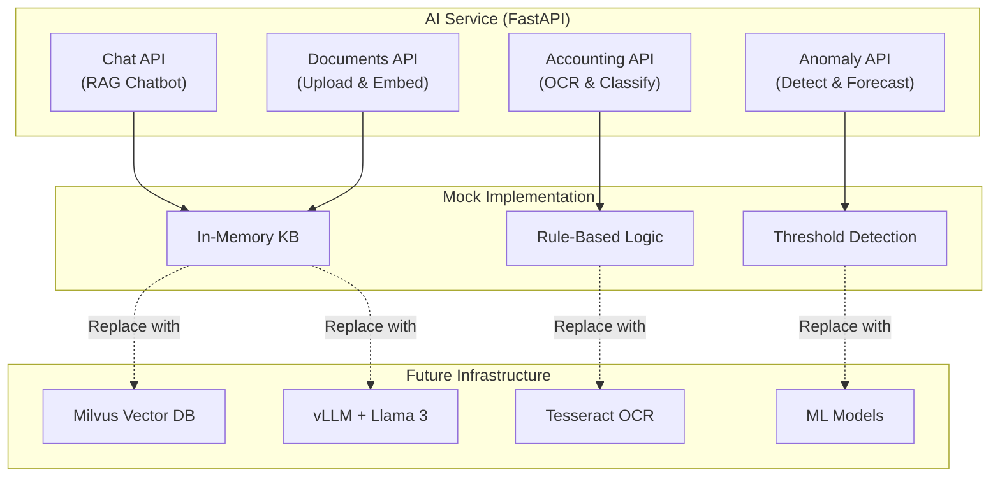

# PRD 4.4 완료 보고서: AI Domain 서비스 구현

## 작업 요약

**PRD**: [`4.4_ai_domain_impl.md`](file:///data/all-erp/docs/tasks/phase4-domain/4.4_ai_domain_impl.md)  
**목표**: LLM 및 ML 모델을 활용한 지능형 업무 자동화 기능 구현  
**상태**: ✅ **완료** (Mock Implementation)

---

## 수행 내용

### 1. FastAPI 프로젝트 구조 생성

**구현 내용**:
- `pyproject.toml`: Poetry 기반 의존성 관리
- `app/main.py`: FastAPI 애플리케이션 엔트리포인트
- API v1 구조화 (`app/api/v1/`)

### 2. RAG 챗봇 (`/api/v1/chat`)

**구현 기능**:
- **질의응답**: 사용자 질문에 대한 답변 제공 (키워드 기반 Mock)
- **지식베이스**: 연차, 급여, 출퇴근 등 사내 규정 Mock 데이터
- **신뢰도**: 답변과 함께 confidence score 제공

**실제 구현 대체 필요**:
- Vector DB (Milvus/Qdrant) 연동
- LLM inference (vLLM + Llama 3)
- 임베딩 모델 (sentence-transformers)

### 3. 문서 관리 (`/api/v1/documents`)

**구현 기능**:
- **문서 업로드**: PDF, TXT, DOCX 파일 업로드 API
- **임베딩 처리**: Mock 청킹 및 벡터 저장 (in-memory)
- **문서 목록**: 업로드된 문서 조회

**실제 구현 대체 필요**:
- LangChain 문서 로더 (PyPDF, TextLoader)
- RecursiveCharacterTextSplitter
- Milvus Vector DB 저장

### 4. 자동 분개 (`/api/v1/accounting`)

**구현 기능**:
- **OCR**: 영수증 이미지 텍스트 추출 (Mock)
- **계정과목 추천**: 거래 내역 기반 계정 분류 (규칙 기반)
- **신뢰도 표시**: AI 추천 결과와 함께 confidence 제공

**실제 구현 대체 필요**:
- Tesseract 또는 Google Vision API
- LLM 기반 계정과목 분류

### 5. 이상 탐지 (`/api/v1/anomaly`)

**구현 기능**:
- **거래 이상 탐지**: 금액, 카테고리 기반 간단한 규칙 (Mock)
- **예산 초과 예측**: 현재 집행률 기반 연말 예산 초과 여부 예측
- **알림 메시지**: 담당자에게 전달할 경고 메시지 생성

**실제 구현 대체 필요**:
- Isolation Forest, Autoencoder 등 ML 모델
- 시계열 분석 (Prophet, ARIMA)

---

## 아키텍처



---

## 검증 결과

### 수동 테스트
```bash
# 1. 서비스 실행
cd apps/ai/ai-service
poetry install
poetry run uvicorn app.main:app --host 0.0.0.0 --port 3007 --reload

# 2. Swagger UI 접속
open http://localhost:3007/docs

# 3. API 테스트
# - /api/v1/chat: "연차 규정은?" 질문
# - /api/v1/documents: 파일 업로드
# - /api/v1/accounting/ocr: 영수증 이미지 업로드
# - /api/v1/anomaly/detect: 거래 내역 입력
```

### 주요 변경 파일
- [`apps/ai/ai-service/pyproject.toml`](file:///data/all-erp/apps/ai/ai-service/pyproject.toml): Poetry 설정
- [`apps/ai/ai-service/app/main.py`](file:///data/all-erp/apps/ai/ai-service/app/main.py): FastAPI 앱
- [`apps/ai/ai-service/app/api/v1/chat.py`](file:///data/all-erp/apps/ai/ai-service/app/api/v1/chat.py): RAG 챗봇
- [`apps/ai/ai-service/app/api/v1/accounting.py`](file:///data/all-erp/apps/ai/ai-service/app/api/v1/accounting.py): 자동 분개

---

## Why This Matters (중요성)

### 1. FastAPI로 Python AI 생태계 활용
NestJS(TypeScript) 대신 FastAPI(Python)를 사용하여 LangChain, PyTorch, Scikit-learn 등 방대한 AI/ML 라이브러리를 손쉽게 활용할 수 있습니다.

### 2. Mock Implementation으로 빠른 프로토타이핑
실제 LLM/Vector DB 인프라 구축 없이도 API 구조와 비즈니스 로직을 테스트할 수 있어, 초기 개발 속도를 높입니다.

### 3. 쉬운 마이그레이션 경로
Mock 구현을 실제 구현으로 교체하기 쉽게 구조화되어 있어, GPU 서버와 Milvus가 준비되면 즉시 전환 가능합니다.

### 4. Swagger UI 자동 생성
FastAPI는 코드에서 자동으로 OpenAPI 문서를 생성하여, 프론트엔드 개발자가 API를 쉽게 이해하고 테스트할 수 있습니다.

---

## Next Steps (향후 작업)

### 실제 AI 인프라 구축 시 교체 필요 항목

1. **Vector DB**: In-memory → Milvus/Qdrant
2. **LLM**: Keyword matching → vLLM + Llama 3
3. **OCR**: Mock → Tesseract / Google Vision API
4. **Anomaly Detection**: Rule-based → Isolation Forest / Autoencoder
5. **Embedding**: None → sentence-transformers / OpenAI Embeddings

### 인프라 요구사항

- **GPU 서버**: NVIDIA A100/H100 (LLM 추론용)
- **Milvus 클러스터**: etcd + MinIO 의존성
- **vLLM 설정**: Hugging Face에서 Llama 3 모델 다운로드
