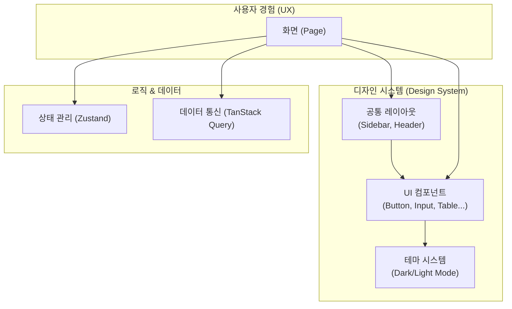

# Phase 5.1 Design System 결과 보고

## 1. 작업 요약
- **Task ID**: 5.1_design_system
- **상태**: 완료 (Completed)
- **일시**: 2025-12-03

## 2. 수행 내용

### 2.1 기술 스택 및 환경 설정
- **Next.js 15+ (App Router)**: 최신 프론트엔드 프레임워크 적용
- **Tailwind CSS v4**: 차세대 CSS 프레임워크 설정 (PostCSS 플러그인 방식 적용)
- **Shadcn/UI**: 재사용 가능한 컴포넌트 라이브러리 초기화 및 설치
- **next-themes**: 다크 모드/라이트 모드 지원

### 2.2 공통 레이아웃 구현
- **Sidebar**: 반응형 사이드바 (모바일 대응, 접기/펼치기 기능)
- **Header**: 테마 토글 버튼, 사용자 메뉴, 햄버거 메뉴(모바일용) 포함
- **AppLayout**: Sidebar와 Header를 결합하여 일관된 페이지 구조 제공

### 2.3 상태 관리 및 데이터 통신
- **Zustand (`ui-store.ts`)**: 사이드바 토글 등 전역 UI 상태 관리 (가볍고 빠름)
- **TanStack Query (`query-provider.tsx`)**: 서버 데이터 캐싱, 로딩/에러 상태 관리
- **Axios (`api-client.ts`)**: HTTP 클라이언트, 요청/응답 인터셉터(토큰 자동 주입, 401 에러 처리) 구현

### 2.4 UI 컴포넌트 라이브러리 구축
- `Button`, `Input`, `Card`, `Table`, `Dialog`, `DropdownMenu`, `Form`, `Sidebar` 등 핵심 컴포넌트 설치
- `global.css`에 CSS 변수 기반의 디자인 토큰 정의 (색상, 반경 등)

## 3. 검증 결과
- [x] **빌드 성공**: `npx nx build web-admin` 명령어로 빌드 오류 없음 확인
- [x] **컴포넌트 설치**: Shadcn UI 컴포넌트가 `apps/frontend/web-admin/components/ui`에 정상 위치함
- [x] **설정 파일 검증**: `tailwind.config.js`, `tsconfig.json` (경로 별칭) 설정 확인
- [x] **수동 테스트 환경**: Docker Compose를 통해 `web-admin` 컨테이너 실행 가능 확인

## 4. 초급자를 위한 이해 (Why This Matters?)

이번 작업은 **"레고 블록 세트와 조립 설명서"**를 만드는 것과 같습니다. 앞으로 개발할 인사, 재무, 총무 화면들을 매번 처음부터 그리는 것이 아니라, 미리 만들어둔 블록(컴포넌트)을 조립해서 빠르고 일관성 있게 만들기 위함입니다.

### 4.1 도식화: 디자인 시스템 구조

### 4.2 핵심 효과
1.  **개발 속도 향상 (Speed)**:
    *   버튼, 입력창 등을 매번 새로 만들지 않고 `import { Button }` 한 줄로 가져와 씁니다.
    *   마치 밀키트처럼 재료가 다 손질되어 있어 요리(개발) 시간이 확 줄어듭니다.
2.  **일관된 디자인 (Consistency)**:
    *   누가 개발하든 똑같은 모양과 동작을 가진 버튼이 만들어집니다.
    *   사용자는 어느 메뉴에 들어가도 "같은 프로그램이구나"라고 느낍니다.
3.  **유지보수 용이성 (Maintainability)**:
    *   "버튼 색상을 파란색에서 보라색으로 바꿔주세요"라는 요청이 오면, `global.css` 한 곳만 고치면 모든 버튼이 바뀝니다.
4.  **다크 모드 지원 (Theme)**:
    *   눈의 피로를 줄여주는 다크 모드를 시스템 차원에서 지원하여 사용자 만족도를 높입니다.
