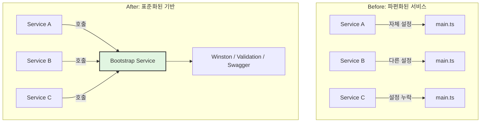

# Phase 1 완료 보고서: 공통 기반 (Common Foundation)

## 작업 요약

**목표**: 모든 마이크로서비스가 일관된 방식으로 초기화되고, 정해진 아키텍처 규칙을 준수하도록 공통 기반을 마련합니다.
**상태**: ✅ **완료**

---

## 수행 내용

### 1. Shared Bootstrap 구현 (`@all-erp/shared/infra`)

모든 서비스의 `main.ts`에서 중복되는 초기화 로직을 제거하고 표준화했습니다.

**주요 기능**:
- **Winston Logger 자동 설정**: 환경(Dev/Prod)에 따른 로그 레벨 및 포맷 자동 적용
- **Global Prefix**: `/api` 기본값 적용
- **ValidationPipe**: `whitelist`, `transform` 옵션 기본 적용
- **Global Exception Filter**: 표준 에러 응답 포맷 적용
- **Swagger**: 옵션 한 줄로 문서화 자동 적용

**코드 예시**:
```typescript
// Before (각 서비스마다 반복)
const app = await NestFactory.create(AppModule);
app.useGlobalPipes(new ValidationPipe(...));
app.useGlobalFilters(new GlobalExceptionFilter());
// ... 설정 코드 20줄 ...

// After (표준화됨)
await bootstrapService({
  module: AppModule,
  serviceName: 'my-service',
  swagger: { title: 'My API', ... }
});
```

### 2. 프로젝트 구조 및 린트 강화

**문서화**:
- [`docs/guides/project-structure.md`](file:///data/all-erp/docs/guides/project-structure.md): 폴더 구조 및 네이밍 컨벤션 정의
- [`docs/human/architecture_standard.md`](file:///data/all-erp/docs/human/architecture_standard.md): 아키텍처 표준 가이드

**Lint 규칙**:
- `@nx/enforce-module-boundaries` 규칙을 통해 잘못된 의존성 참조 방지
- 전체 프로젝트 Lint 검사 완료 (`nx run-many --target=lint`)

---

## 아키텍처 변화



---

## Why This Matters (중요성)

1.  **설정의 일관성**: 개발자가 실수로 ValidationPipe를 누락하거나 로깅 설정을 다르게 하는 것을 원천 차단합니다.
2.  **생산성 향상**: 새로운 마이크로서비스 생성 시 `main.ts` 작성 시간이 단축됩니다.
3.  **유지보수 용이**: 로깅 라이브러리를 교체하거나 전역 설정을 변경할 때 `bootstrapService` 하나만 수정하면 전사 적용됩니다.

---

## 다음 단계 (Phase 2)

이제 마련된 공통 기반을 핵심 서비스에 실제로 적용합니다.

- **Auth Service**: `bootstrapService` 적용 및 리팩토링
- **System Service**: `bootstrapService` 적용 및 리팩토링
- **Tenant Service**: `bootstrapService` 적용 및 리팩토링
