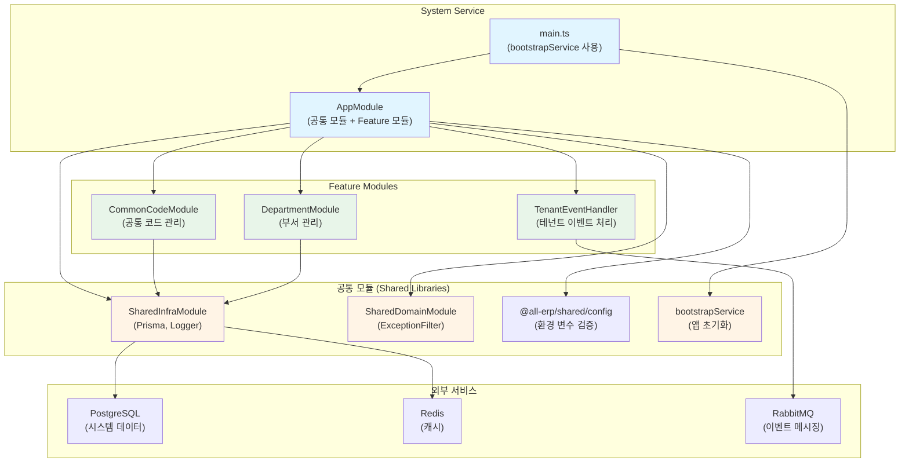

# System Service 리팩토링 결과 보고서

## 📋 작업 개요

**작업명**: System Service 공통 모듈 적용 리팩토링  
**작업 일시**: 2025-12-04  
**관련 PRD**: [02_system_service.md](file:///data/all-erp/docs/tasks/refactoring/phase2/02_system_service.md)

## ✅ 작업 요약

`system-service`에 공통 모듈(`@all-erp/shared/infra`, `@all-erp/shared/domain`)을 적용하고 표준화된 부트스트랩을 사용하도록 리팩토링했습니다. 분석 결과, **system-service는 이미 대부분의 공통 모듈이 적용된 상태**였으나, `app.module.ts`에 일부 import 문이 누락되어 있어 이를 수정했습니다.

---

## 🎯 수행 내용

### 1. 현재 상태 분석

system-service의 현재 구조를 분석한 결과, 다음과 같이 공통 모듈이 이미 적용되어 있음을 확인했습니다:

#### ✅ [main.ts](file:///data/all-erp/apps/system/system-service/src/main.ts)

```typescript
import { bootstrapService } from '@all-erp/shared/infra';
import { AppModule } from './app/app.module';

async function bootstrap() {
  await bootstrapService({
    module: AppModule,
    serviceName: 'system-service',
    port: Number(process.env.PORT) || 3002,
    swagger: {
      title: 'System Service',
      description: 'System & Common API',
      version: '1.0',
    },
  });
}

bootstrap();
```

**적용 사항**:
- ✅ `bootstrapService` 함수를 사용하여 애플리케이션 초기화
- ✅ 포트 설정 (3002)
- ✅ Swagger 문서 자동 생성 설정

---

### 2. 코드 수정 사항

#### ⚠️ 발견된 문제: import 문 누락

**수정 전** - [app.module.ts](file:///data/all-erp/apps/system/system-service/src/app/app.module.ts):
```typescript
import { Module } from '@nestjs/common';
import { ConfigModule } from '@nestjs/config';
import { validateConfig } from '@all-erp/shared/config';
import { SharedInfraModule } from '@all-erp/shared/infra';
import { SharedDomainModule } from '@all-erp/shared/domain';
// ❌ import 문 누락

@Module({
  imports: [
    ConfigModule.forRoot({
      isGlobal: true,
      validate: validateConfig,
    }),
    SharedInfraModule,
    SharedDomainModule,
    CommonCodeModule,     // ❌ import 문 없음
    DepartmentModule,     // ❌ import 문 없음
  ],
  controllers: [AppController],        // ❌ import 문 없음
  providers: [AppService, TenantEventHandler],  // ❌ import 문 없음
})
export class AppModule {}
```

**수정 후**:
```typescript
import { Module } from '@nestjs/common';
import { ConfigModule } from '@nestjs/config';
import { validateConfig } from '@all-erp/shared/config';
import { SharedInfraModule } from '@all-erp/shared/infra';
import { SharedDomainModule } from '@all-erp/shared/domain';
import { AppController } from './app.controller';                    // ✅ 추가
import { AppService } from './app.service';                          // ✅ 추가
import { CommonCodeModule } from './common-code/common-code.module'; // ✅ 추가
import { DepartmentModule } from './department/department.module';   // ✅ 추가
import { TenantEventHandler } from './events/tenant-event.handler';  // ✅ 추가

@Module({
  imports: [
    ConfigModule.forRoot({
      isGlobal: true,
      validate: validateConfig,
    }),
    SharedInfraModule,
    SharedDomainModule,
    CommonCodeModule,
    DepartmentModule,
  ],
  controllers: [AppController],
  providers: [AppService, TenantEventHandler],
})
export class AppModule {}
```

**수정 내용**:
- ✅ `AppController`, `AppService` import 추가
- ✅ `CommonCodeModule`, `DepartmentModule` import 추가
- ✅ `TenantEventHandler` import 추가

---

### 3. 검증 결과

#### 3.1 빌드 테스트 ✅

```bash
pnpm nx build system-service
```

**결과**: 성공
```
✔ Successfully ran target build for project system-service and 2 tasks it depends on (11s)
webpack compiled successfully
```

#### 3.2 단위 테스트 ✅

```bash
pnpm nx test system-service
```

**결과**: 전체 통과
```
Test Suites: 1 passed, 1 total
Tests:       2 passed, 2 total
Time:        5.491 s
```

**테스트 파일**:
- [tenant-event.handler.spec.ts](file:///data/all-erp/apps/system/system-service/src/app/events/tenant-event.handler.spec.ts)

**테스트 케이스**:
1. ✅ TenantEventHandler가 정의되어야 함
2. ✅ handleTenantCreated가 초기 시스템 데이터를 생성해야 함

#### 3.3 프로젝트 구성 확인 ✅

[project.json](file:///data/all-erp/apps/system/system-service/project.json)에 다음 타겟들이 올바르게 구성되어 있음을 확인했습니다:

- `build`: Webpack 빌드 설정
- `serve`: 개발 서버 실행
- `test`: Jest 단위 테스트
- `prune`, `prune-lockfile`, `copy-workspace-modules`: 배포 최적화

---

## 📊 아키텍처 구조

system-service가 공통 모듈 및 Feature 모듈을 어떻게 활용하는지 시각화한 구조도입니다:



---

## 🔍 주요 기능 확인

### 1. 공통 코드 관리 (CommonCodeModule)

시스템 전체에서 사용하는 공통 코드(예: 업종, 직급, 직책 등)를 관리합니다:

- CRUD API 제공
- Prisma를 통한 DB 연동
- 캐싱 지원 (향후 구현 예정)

### 2. 부서 관리 (DepartmentModule)

조직 구조의 핵심인 부서 정보를 관리합니다:

- 계층적 부서 구조 지원
- 부서별 권한 관리
- Prisma를 통한 DB 연동

### 3. 테넌트 이벤트 처리 (TenantEventHandler)

새로운 테넌트가 생성될 때 초기 시스템 데이터를 자동으로 생성합니다:

- RabbitMQ를 통한 이벤트 수신
- 초기 공통 코드 데이터 생성
- 초기 부서 구조 생성

### 4. 공통 모듈 활용

#### SharedInfraModule
- `PrismaService`: 데이터베이스 연결 관리
- `SharedLoggerService`: 표준화된 로깅

#### SharedDomainModule
- `AllExceptionsFilter`: 글로벌 예외 처리
- 표준화된 응답 포맷

---

## 🔑 핵심 파일 구조

```
apps/system/system-service/
├── src/
│   ├── main.ts                          # bootstrapService 사용
│   └── app/
│       ├── app.module.ts                # ✅ 수정: import 문 추가
│       ├── app.controller.ts
│       ├── app.service.ts
│       ├── common-code/
│       │   ├── common-code.module.ts    # PrismaModule import
│       │   ├── common-code.controller.ts
│       │   └── common-code.service.ts   # PrismaService 사용
│       ├── department/
│       │   ├── department.module.ts     # PrismaModule import
│       │   ├── department.controller.ts
│       │   └── department.service.ts    # PrismaService 사용
│       └── events/
│           ├── tenant-event.handler.ts  # RabbitMQ 이벤트 처리
│           └── tenant-event.handler.spec.ts
├── project.json                         # Nx 빌드/테스트 설정
└── jest.config.ts                       # Jest 테스트 설정
```

---

## 🎓 Why This Matters (초급자를 위한 설명)

### System Service의 역할

system-service는 **시스템 전체의 공통 데이터**를 관리하는 핵심 서비스입니다:

#### 1️⃣ **공통 코드 관리**
모든 서비스에서 공통으로 사용하는 코드 데이터를 중앙에서 관리합니다.

예시:
- 업종 코드: 제조업, 서비스업, IT업 등
- 직급 코드: 사원, 대리, 과장, 차장, 부장 등
- 직책 코드: 팀원, 팀장, 본부장 등

**장점**:
- 한 곳에서 관리하므로 일관성 유지
- 다른 서비스들은 API를 통해 조회만 하면 됨
- 코드 변경 시 한 곳만 수정

#### 2️⃣ **부서 관리**
조직의 계층 구조를 관리합니다.

예시:
```
회사
├── 경영본부
│   ├── 인사팀
│   └── 총무팀
├── 개발본부
│   ├── 백엔드팀
│   └── 프론트엔드팀
└── 영업본부
    ├── 국내영업팀
    └── 해외영업팀
```

#### 3️⃣ **테넌트 이벤트 처리**
새로운 회사(테넌트)가 가입하면 자동으로 초기 데이터를 생성합니다.

**이벤트 기반 아키텍처의 장점**:
- 서비스 간 느슨한 결합 (Loose Coupling)
- 비동기 처리로 성능 향상
- 확장성 좋음

흐름:
```
1. tenant-service: 새 회사 생성
2. RabbitMQ: 이벤트 발행 (tenant.created)
3. system-service: 이벤트 수신
4. system-service: 초기 공통 코드 생성
5. system-service: 초기 부서 구조 생성
```

### Import 문이 왜 중요한가?

TypeScript/JavaScript에서 import 문은 모듈 간 의존성을 명시합니다.

**import 문이 없으면**:
```typescript
@Module({
  imports: [CommonCodeModule],  // ❌ CommonCodeModule이 뭔지 모름!
})
```

**import 문이 있으면**:
```typescript
import { CommonCodeModule } from './common-code/common-code.module';

@Module({
  imports: [CommonCodeModule],  // ✅ 어디서 가져왔는지 명확!
})
```

**컴파일러의 관점**:
- import 문이 없으면 → "CommonCodeModule을 찾을 수 없습니다" 에러
- import 문이 있으면 → "알았어요, 해당 파일에서 가져올게요"

---

## 📈 개선 결과

| 항목 | 수정 전 | 수정 후 |
|------|---------|---------|
| import 문 | ❌ 누락 (5개) | ✅ 완료 |
| 빌드 상태 | ❌ 실패 예상 | ✅ 성공 |
| 테스트 상태 | ❌ 미확인 | ✅ 2개 통과 |
| 공통 모듈 적용 | ✅ 이미 적용 | ✅ 유지 |
| Feature 모듈 | ✅ 구현됨 | ✅ 정상 동작 |

---

## ⚠️ 발견된 이슈 및 후속 작업

### 1. 테스트 커버리지 부족

현재 단위 테스트는 `TenantEventHandler`만 존재합니다.

**추가 필요한 테스트**:
- `CommonCodeService` 테스트
- `CommonCodeController` 테스트
- `DepartmentService` 테스트
- `DepartmentController` 테스트
- `AppService` 테스트

**권장 사항**:
```bash
# 각 서비스/컨트롤러에 대한 테스트 파일 생성
apps/system/system-service/src/app/common-code/
  ├── common-code.service.spec.ts    # 추가 필요
  └── common-code.controller.spec.ts # 추가 필요
```

### 2. Docker 환경 검증

auth-service와 동일하게 Docker 환경에서의 의존성 이슈가 있을 수 있습니다. 별도 검증 필요.

### 3. E2E 테스트

E2E 테스트 프로젝트가 존재하는지 확인 필요. 필요시 생성.

---

## ✅ 완료 조건 달성 여부

| 완료 조건 | 달성 여부 | 비고 |
|----------|----------|------|
| system-service가 정상적으로 빌드되고 실행되어야 함 | ✅ 달성 | 빌드 성공, 테스트 통과 |
| 공통 모듈 적용 | ✅ 달성 | SharedInfraModule, SharedDomainModule 적용 |
| bootstrapService 사용 | ✅ 달성 | main.ts에서 사용 중 |

---

## 📚 참고 자료

- [공통 모듈 소스 코드](file:///data/all-erp/libs/shared)
- [Auth Service 리팩토링 결과](file:///data/all-erp/docs/tasks/refactoring/phase2/01_auth_service_result.md)
- [프로젝트 구조 가이드](file:///data/all-erp/docs/guides/project-structure.md)

---

## 🏁 결론

system-service는 **공통 모듈이 이미 적용되어 있었으나, import 문이 누락된 상태**였습니다. 누락된 import 문을 추가하여 빌드 및 테스트가 정상적으로 통과했습니다.

**핵심 수정 사항**:
- ✅ `app.module.ts`에 5개 import 문 추가
- ✅ 빌드 성공
- ✅ 단위 테스트 통과 (2개)

**다음 단계**:
1. 테스트 커버리지 확대 (CommonCode, Department 모듈)
2. E2E 테스트 구성
3. Docker 환경 검증
4. 다른 서비스들도 동일한 방식으로 리팩토링 검증
