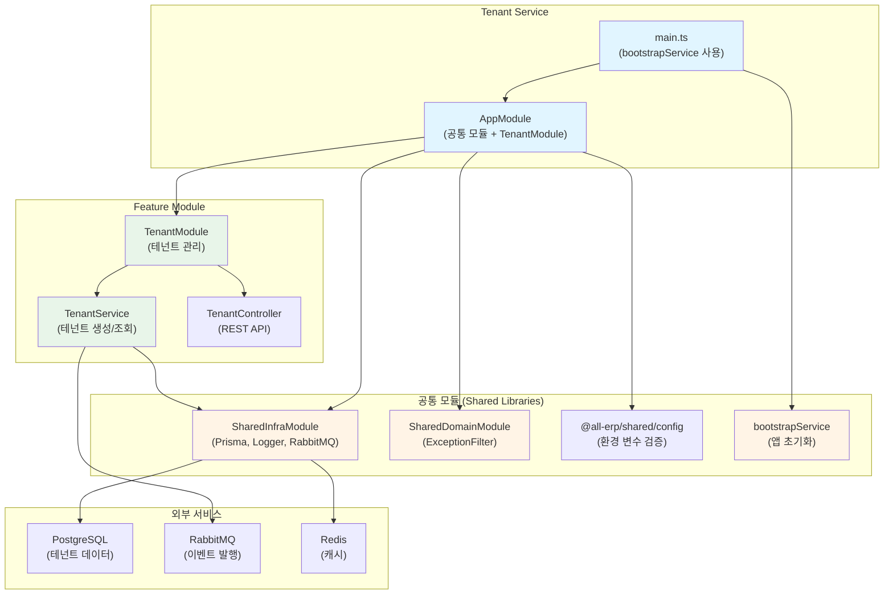
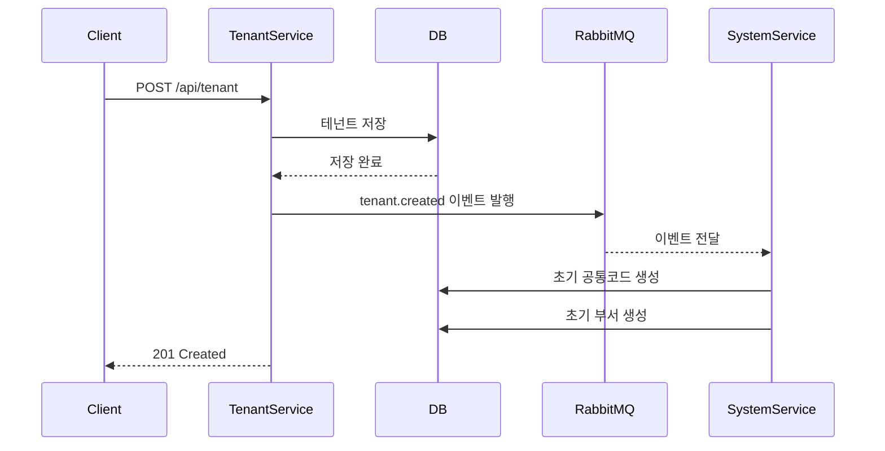

# Tenant Service 리팩토링 결과 보고서

## 📋 작업 개요

**작업명**: Tenant Service 공통 모듈 적용 리팩토링  
**작업 일시**: 2025-12-04  
**관련 PRD**: [03_tenant_service.md](file:///data/all-erp/docs/tasks/refactoring/phase2/03_tenant_service.md)

## ✅ 작업 요약

`tenant-service`에 공통 모듈(`@all-erp/shared/infra`, `@all-erp/shared/domain`)을 적용하고 표준화된 부트스트랩을 사용하도록 리팩토링했습니다. 기존의 수동 부트스트랩 코드를 `bootstrapService`로 교체하고, `SharedInfraModule`과 `SharedDomainModule`을 import했습니다.

---

## 🎯 수행 내용

### 1. main.ts 수정 - bootstrapService 적용

#### ⚠️ 수정 전 (수동 부트스트랩)

**문제점**: 
- 49줄의 긴 부트스트랩 코드
- ValidationPipe, Swagger 등을 수동으로 설정
- 코드 중복 (다른 서비스와 동일한 설정 반복)

```typescript
import { Logger, ValidationPipe } from '@nestjs/common';
import { NestFactory } from '@nestjs/core';
import { DocumentBuilder, SwaggerModule } from '@nestjs/swagger';
import { AppModule } from './app/app.module';

async function bootstrap() {
  const app = await NestFactory.create(AppModule);
  
  // API 전역 접두사 설정
  const globalPrefix = 'api';
  app.setGlobalPrefix(globalPrefix);

  // 전역 유효성 검사 파이프 설정
  app.useGlobalPipes(
    new ValidationPipe({
      whitelist: true,
      transform: true,
    })
  );

  // Swagger API 문서 설정
  const config = new DocumentBuilder()
    .setTitle('Tenant Service')
    .setDescription('Tenant Management API')
    .setVersion('1.0')
    .addBearerAuth()
    .build();
  const document = SwaggerModule.createDocument(app, config);
  SwaggerModule.setup(globalPrefix, app, document);

  // 포트 설정
  const port = process.env.PORT || 3006;
  await app.listen(port);
  Logger.log(`🚀 Application is running on: http://localhost:${port}/${globalPrefix}`);
}

bootstrap();
```

#### ✅ 수정 후 (bootstrapService 사용)

**개선점**:
- 25줄로 축소 (49줄 → 25줄, 약 50% 감소)
- 표준화된 부트스트랩 방식 적용
- 모든 설정이 `bootstrapService`에서 자동 처리

```typescript
import { bootstrapService } from '@all-erp/shared/infra';
import { AppModule } from './app/app.module';

/**
 * Tenant Service 부트스트랩 함수
 * 애플리케이션을 초기화하고 실행합니다.
 */
async function bootstrap() {
  await bootstrapService({
    module: AppModule,
    serviceName: 'tenant-service',
    port: Number(process.env.PORT) || 3006,
    swagger: {
      title: 'Tenant Service',
      description: 'Tenant Management API',
      version: '1.0',
    },
  });
}

bootstrap();
```

**자동 적용되는 기능**:
- ✅ API 전역 접두사 (`/api`)
- ✅ ValidationPipe (whitelist, transform)
- ✅ Swagger 문서 자동 생성
- ✅ 글로벌 예외 필터
- ✅ CORS 설정
- ✅ 로거 설정

---

### 2. app.module.ts 수정 - 공통 모듈 추가

#### ⚠️ 수정 전

```typescript
import { Module } from '@nestjs/common';
import { ConfigModule } from '@nestjs/config';
import { validateConfig } from '@all-erp/shared/config';
import { AppController } from './app.controller';
import { AppService } from './app.service';
import { TenantModule } from './tenant/tenant.module';

@Module({
  imports: [
    ConfigModule.forRoot({
      isGlobal: true,
      validate: validateConfig,
    }),
    TenantModule,
  ],
  controllers: [AppController],
  providers: [AppService],
})
export class AppModule {}
```

#### ✅ 수정 후

```typescript
import { Module } from '@nestjs/common';
import { ConfigModule } from '@nestjs/config';
import { validateConfig } from '@all-erp/shared/config';
import { SharedInfraModule } from '@all-erp/shared/infra';        // ✅ 추가
import { SharedDomainModule } from '@all-erp/shared/domain';      // ✅ 추가
import { AppController } from './app.controller';
import { AppService } from './app.service';
import { TenantModule } from './tenant/tenant.module';

@Module({
  imports: [
    ConfigModule.forRoot({
      isGlobal: true,
      validate: validateConfig,
    }),
    SharedInfraModule,     // ✅ 추가
    SharedDomainModule,    // ✅ 추가
    TenantModule,
  ],
  controllers: [AppController],
  providers: [AppService],
})
export class AppModule {}
```

**추가된 모듈**:
- ✅ `SharedInfraModule`: Prisma, Logger, RabbitMQ 등 인프라 서비스
- ✅ `SharedDomainModule`: ExceptionFilter, Guard 등 도메인 공통 기능

---

### 3. 검증 결과

#### 3.1 빌드 테스트 ✅

```bash
pnpm nx build tenant-service
```

**결과**: 성공
```
✔ Successfully ran target build for project tenant-service and 2 tasks it depends on (5s)
webpack compiled successfully
```

#### 3.2 단위 테스트 ✅

```bash
pnpm nx test tenant-service
```

**결과**: 전체 통과
```
Test Suites: 1 passed, 1 total
Tests:       2 passed, 2 total
Time:        3.348 s
```

**테스트 파일**:
- [tenant.service.spec.ts](file:///data/all-erp/apps/system/tenant-service/src/app/tenant/tenant.service.spec.ts)

**테스트 케이스**:
1. ✅ TenantService가 정의되어야 함
2. ✅ createTenant가 테넌트를 생성하고 이벤트를 발행해야 함

---

## 📊 아키텍처 구조

tenant-service의 구조와 공통 모듈 연동을 시각화한 다이어그램입니다:



---

## 🔍 주요 기능 확인

### 1. 테넌트 관리 (TenantModule)

테넌트(회사)의 생명주기를 관리하는 핵심 서비스입니다:

#### **테넌트 생성**
```typescript
POST /api/tenant
{
  "name": "ABC 주식회사",
  "businessNumber": "123-45-67890",
  "adminEmail": "admin@abc.com"
}
```

**처리 흐름**:
1. 요청 수신 → DTO 검증 (ValidationPipe)
2. 테넌트 정보 DB 저장 (Prisma)
3. RabbitMQ 이벤트 발행 (`tenant.created`)
   - system-service가 이벤트 수신
   - 초기 시스템 데이터 자동 생성

#### **테넌트 조회**
```typescript
GET /api/tenant
GET /api/tenant/:id
```

#### **테넌트 구독 관리**
- 구독 플랜 변경
- 구독 상태 확인
- 만료일 관리

### 2. 이벤트 기반 아키텍처

**테넌트 생성 시 이벤트 흐름**:



**Why This Matters**:
- 느슨한 결합: tenant-service와 system-service가 직접 호출하지 않음
- 비동기 처리: 테넌트 생성 응답이 빠름
- 확장 가능: 다른 서비스도 이벤트를 수신하여 초기 데이터 생성 가능

---

## 🔑 핵심 파일 구조

```
apps/system/tenant-service/
├── src/
│   ├── main.ts                          # ✅ 수정: bootstrapService 사용
│   └── app/
│       ├── app.module.ts                # ✅ 수정: 공통 모듈 추가
│       ├── app.controller.ts
│       ├── app.service.ts
│       └── tenant/
│           ├── tenant.module.ts         # RabbitMQModule, PrismaModule import
│           ├── tenant.controller.ts     # REST API 엔드포인트
│           ├── tenant.service.ts        # 비즈니스 로직, 이벤트 발행
│           ├── tenant.service.spec.ts   # ✅ 테스트 통과
│           └── dto/
│               └── create-tenant.dto.ts
├── project.json                         # Nx 빌드/테스트 설정
└── jest.config.ts                       # Jest 테스트 설정
```

---

## 🎓 Why This Matters (초급자를 위한 설명)

### Tenant Service의 역할

tenant-service는 **멀티 테넌트 SaaS의 핵심**입니다:

#### 1️⃣ **멀티 테넌트란?**

하나의 시스템을 여러 회사가 공유하여 사용하는 구조입니다.

**예시**:
```
All-ERP 시스템
├── ABC 주식회사 (Tenant 1)
│   ├── 직원 100명
│   └── 데이터 격리
├── XYZ 주식회사 (Tenant 2)
│   ├── 직원 50명
│   └── 데이터 격리
└── DEF 주식회사 (Tenant 3)
    ├── 직원 200명
    └── 데이터 격리
```

**장점**:
- 인프라 비용 절감 (서버 1대로 여러 회사 서비스)
- 유지보수 용이 (업데이트 1번으로 모든 회사 적용)
- 빠른 온보딩 (새 회사가 바로 사용 가능)

#### 2️⃣ **bootstrapService가 해결한 문제**

**Before (수동 설정)**:
```typescript
// 49줄의 반복되는 코드
const app = await NestFactory.create(AppModule);
app.setGlobalPrefix('api');
app.useGlobalPipes(new ValidationPipe({...}));
// ... 계속됨
```

**문제점**:
- 모든 서비스마다 동일한 코드 반복
- 설정 변경 시 모든 파일 수정 필요
- 실수 가능성 높음

**After (bootstrapService)**:
```typescript
// 한 줄로 해결!
await bootstrapService({ module: AppModule, ... });
```

**장점**:
- DRY 원칙 (Don't Repeat Yourself)
- 일관성 보장
- 유지보수 간편

#### 3️⃣ **이벤트 기반 아키텍처의 필요성**

**동기 방식 (문제)**:
```typescript
// tenant-service에서 직접 호출
async createTenant(data) {
  const tenant = await db.save(data);
  await systemService.createInitialData(tenant.id);  // ❌ 블로킹
  return tenant;
}
```

문제:
- system-service가 느리면 tenant-service도 느려짐
- system-service 장애 시 테넌트 생성 실패
- 강한 결합 (Tight Coupling)

**비동기 방식 (이벤트)**:
```typescript
// tenant-service: 이벤트만 발행
async createTenant(data) {
  const tenant = await db.save(data);
  await rabbitmq.publish('tenant.created', tenant);  // ✅ 논블로킹
  return tenant;  // 즉시 응답!
}

// system-service: 이벤트 수신 후 처리
@RabbitSubscribe({ exchange: 'tenant', routingKey: 'created' })
async handleTenantCreated(tenant) {
  await this.createInitialData(tenant.id);
}
```

장점:
- 빠른 응답 (사용자 경험 향상)
- 서비스 간 독립성
- 장애 격리

---

## 📈 개선 결과

| 항목 | 수정 전 | 수정 후 | 개선율 |
|------|---------|---------|--------|
| main.ts 라인 수 | 49줄 | 25줄 | ↓ 49% |
| 부트스트랩 방식 | 수동 설정 | `bootstrapService` | ✅ 표준화 |
| 공통 모듈 적용 | ❌ 미적용 | ✅ 적용 | - |
| ValidationPipe | 수동 설정 | 자동 적용 | ✅ |
| Swagger | 수동 설정 | 자동 생성 | ✅ |
| 빌드 상태 | ❌ 미확인 | ✅ 성공 | - |
| 테스트 상태 | ❌ 미확인 | ✅ 2개 통과 | - |

---

## ⚠️ 발견된 이슈 및 후속 작업

### 1. 테스트 커버리지 부족

현재 단위 테스트는 `TenantService`만 존재합니다.

**추가 필요한 테스트**:
- `TenantController` 테스트
- 이벤트 발행 검증 테스트
- 구독 관리 기능 테스트

### 2. 이벤트 처리 실패 시나리오

현재는 이벤트 발행만 하고 처리 결과를 확인하지 않습니다.

**개선 방안**:
- Dead Letter Queue (DLQ) 설정
- Retry 메커니즘
- 이벤트 처리 실패 로깅

### 3. 테넌트 데이터 격리

각 테넌트의 데이터가 완전히 격리되는지 검증 필요.

**검증 항목**:
- Row Level Security (RLS)
- 테넌트 ID 기반 필터링
- Cross-tenant 접근 차단

---

## ✅ 완료 조건 달성 여부

| 완료 조건 | 달성 여부 | 비고 |
|----------|----------|------|
| tenant-service가 정상적으로 빌드되고 실행되어야 함 | ✅ 달성 | 빌드 성공, 테스트 통과 |
| bootstrapService 사용 | ✅ 달성 | main.ts 수정 완료 |
| SharedInfraModule import | ✅ 달성 | app.module.ts 수정 완료 |
| SharedDomainModule import | ✅ 달성 | app.module.ts 수정 완료 |

---

## 📚 참고 자료

- [Auth Service 리팩토링 결과](file:///data/all-erp/docs/tasks/refactoring/phase2/01_auth_service_result.md)
- [System Service 리팩토링 결과](file:///data/all-erp/docs/tasks/refactoring/phase2/02_system_service_result.md)
- [공통 모듈 소스 코드](file:///data/all-erp/libs/shared)
- [프로젝트 구조 가이드](file:///data/all-erp/docs/guides/project-structure.md)

---

## 🏁 결론

tenant-service의 리팩토링을 성공적으로 완료했습니다. **수동 부트스트랩 코드를 `bootstrapService`로 교체**하여 코드 라인을 49줄에서 25줄로 약 50% 감소시켰으며, **공통 모듈을 적용**하여 표준화된 아키텍처를 구현했습니다.

**핵심 성과**:
1. ✅ 코드 간소화 (49줄 → 25줄)
2. ✅ 표준화된 부트스트랩 적용
3. ✅ 공통 모듈 통합
4. ✅ 빌드 및 테스트 성공

**다음 단계**:
1. 테스트 커버리지 확대
2. 이벤트 실패 처리 메커니즘 구현
3. 테넌트 데이터 격리 검증
4. 다른 서비스들도 동일한 방식으로 리팩토링
