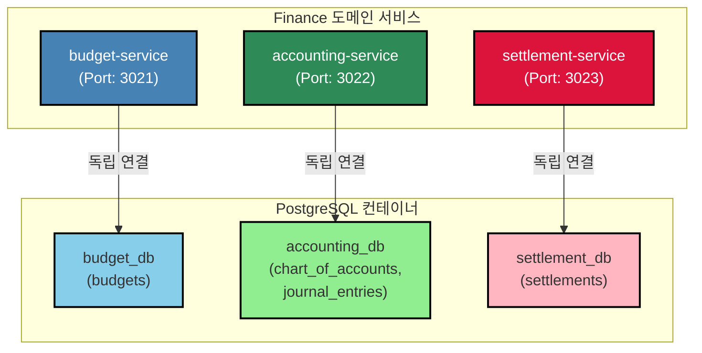
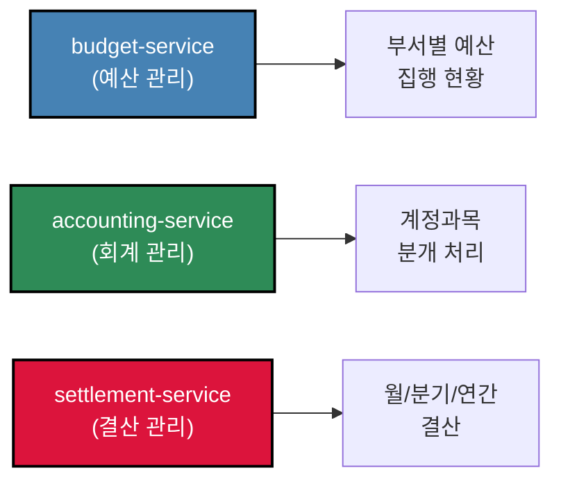
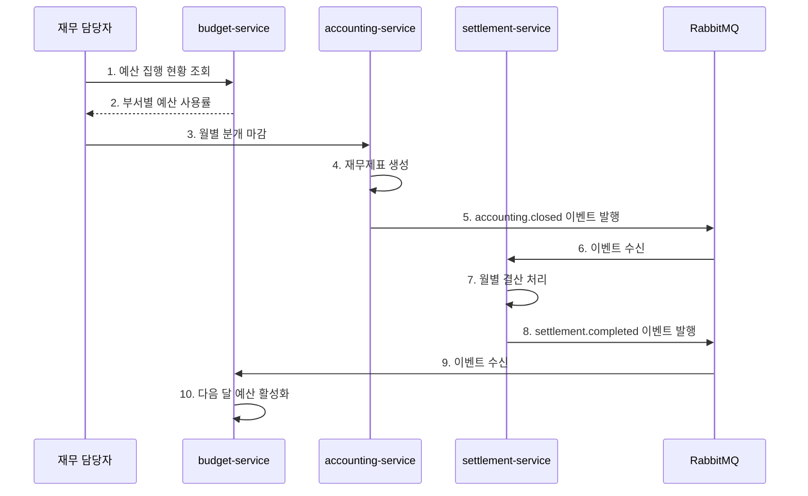
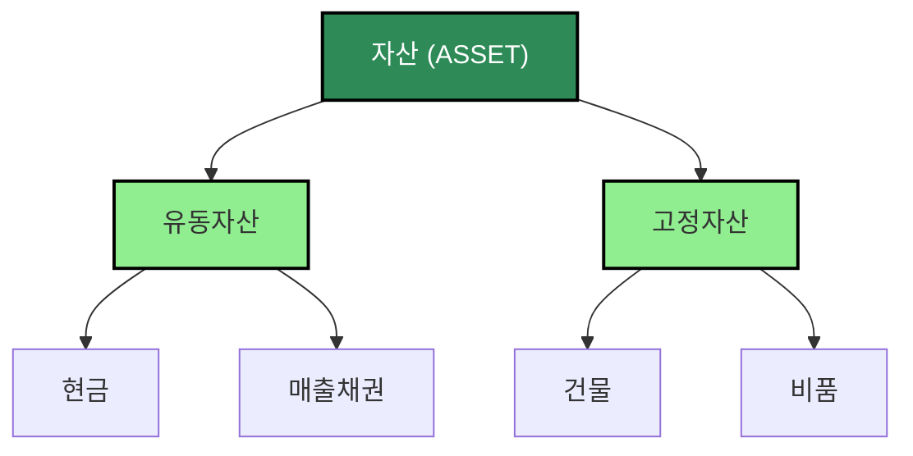

# TASK-P2-03: Finance 도메인 DB 연결 - 결과 보고서

## 📋 작업 요약

**작업 기간**: 2025-12-05  
**담당자**: AI Assistant  
**상태**: ✅ 완료

## 🎯 작업 목표

Finance 도메인(budget, accounting, settlement 서비스)의 DB 연결을 신규 독립 DB로 전환하여 Database per Service 패턴 구현

## ✅ 완료된 작업

### 1. Prisma 7 설정 파일 생성

각 서비스별로 독립적인 `prisma.config.ts` 파일 생성:

**apps/finance/budget-service/prisma.config.ts**:
```typescript
import 'dotenv/config';
import { defineConfig, env } from 'prisma/config';

export default defineConfig({
  schema: './prisma/schema.prisma',
  datasource: {
    url: env('BUDGET_DATABASE_URL'),
  },
});
```

**apps/finance/accounting-service/prisma.config.ts**:
```typescript
import 'dotenv/config';
import { defineConfig, env } from 'prisma/config';

export default defineConfig({
  schema: './prisma/schema.prisma',
  datasource: {
    url: env('ACCOUNTING_DATABASE_URL'),
  },
});
```

**apps/finance/settlement-service/prisma.config.ts**:
```typescript
import 'dotenv/config';
import { defineConfig, env } from 'prisma/config';

export default defineConfig({
  schema: './prisma/schema.prisma',
  datasource: {
    url: env('SETTLEMENT_DATABASE_URL'),
  },
});
```

### 2. Prisma 스키마 수정 (Prisma 7 호환성)

각 서비스의 `schema.prisma`에서 `url` 라인 제거:

**변경 전**:
```prisma
datasource db {
    provider = "postgresql"
    url      = env("DATABASE_URL")
}
```

**변경 후**:
```prisma
datasource db {
    provider = "postgresql"
}
```

### 3. Prisma 마이그레이션 실행

각 서비스별로 독립 데이터베이스에 마이그레이션 실행:

```bash
# budget-service
cd apps/finance/budget-service
pnpm prisma migrate dev --name init --config=/data/all-erp/apps/finance/budget-service/prisma.config.ts

# accounting-service
cd apps/finance/accounting-service
pnpm prisma migrate dev --name init --config=/data/all-erp/apps/finance/accounting-service/prisma.config.ts

# settlement-service
cd apps/finance/settlement-service
pnpm prisma migrate dev --name init --config=/data/all-erp/apps/finance/settlement-service/prisma.config.ts
```

**마이그레이션 결과**:

✅ **budget_db** (budget-service):
- budgets
- processed_events
- outbox_events
- _prisma_migrations

✅ **accounting_db** (accounting-service):
- chart_of_accounts
- journal_entries
- journal_entry_lines
- processed_events
- outbox_events
- _prisma_migrations

✅ **settlement_db** (settlement-service):
- settlements
- processed_events
- outbox_events
- _prisma_migrations

### 4. Prisma Client 생성

각 서비스별로 Prisma Client 생성:

```bash
cd apps/finance/budget-service && pnpm prisma generate --config=/data/all-erp/apps/finance/budget-service/prisma.config.ts
cd apps/finance/accounting-service && pnpm prisma generate --config=/data/all-erp/apps/finance/accounting-service/prisma.config.ts
cd apps/finance/settlement-service && pnpm prisma generate --config=/data/all-erp/apps/finance/settlement-service/prisma.config.ts
```

## 📊 아키텍처 다이어그램



## 🎓 Why This Matters (초급자를 위한 설명)

### 1. Finance 도메인의 서비스 분리 전략

Finance 도메인은 3개의 독립적인 서비스로 구성됩니다:



**왜 3개로 분리했나요?**

1. **budget-service (예산 관리)**
   - 부서별, 항목별 예산 편성
   - 예산 집행 현황 추적
   - 예산 초과 알림

2. **accounting-service (회계 관리)**
   - 계정과목 관리
   - 분개 처리 (차변/대변)
   - 재무제표 생성

3. **settlement-service (결산 관리)**
   - 월별/분기별/연간 결산
   - 결산 마감 처리
   - 결산 보고서 생성

**장점**:
- ✅ **독립 배포**: 예산 시스템 변경이 회계 처리에 영향 없음
- ✅ **확장성**: 결산 시즌에 settlement-service만 스케일링
- ✅ **보안**: 회계 데이터는 accounting-service만 접근 가능

### 2. 복식부기와 분개의 이해

**accounting-service의 핵심: 분개(Journal Entry)**

복식부기는 모든 거래를 차변(Debit)과 대변(Credit)으로 기록합니다:


**예시: 급여 지급**

| 계정과목 | 차변 (Debit) | 대변 (Credit) |
|---------|-------------|--------------|
| 급여 (비용) | 3,000,000원 | |
| 현금 (자산) | | 3,000,000원 |

**데이터 모델**:
```typescript
// JournalEntry (분개)
{
  id: "entry-001",
  entryDate: "2025-12-05",
  description: "12월 급여 지급",
  lines: [
    {
      accountId: "expense-salary",  // 급여 (비용)
      debit: 3000000,
      credit: 0
    },
    {
      accountId: "asset-cash",      // 현금 (자산)
      debit: 0,
      credit: 3000000
    }
  ]
}
```

**차변 = 대변 검증**:
```typescript
// 분개 저장 전 검증
const totalDebit = lines.reduce((sum, line) => sum + line.debit, 0);
const totalCredit = lines.reduce((sum, line) => sum + line.credit, 0);

if (totalDebit !== totalCredit) {
  throw new Error('차변과 대변이 일치하지 않습니다!');
}
```

### 3. 실제 업무 시나리오

**시나리오: 월말 결산 프로세스**



**각 서비스의 역할**:
1. **budget-service**: 예산 집행 현황 제공
2. **accounting-service**: 회계 장부 마감 및 재무제표 생성
3. **settlement-service**: 결산 처리 및 보고서 생성

**이벤트 기반 아키텍처의 장점**:
- ✅ **자동화**: 회계 마감 시 자동으로 결산 프로세스 시작
- ✅ **일관성**: 모든 서비스가 동일한 결산 시점 공유
- ✅ **추적성**: 이벤트 로그로 전체 프로세스 추적 가능

### 4. 계정과목 계층 구조

**accounting-service의 ChartOfAccounts (계정과목)**

계정과목은 계층 구조로 관리됩니다:



**데이터 모델**:
```prisma
model ChartOfAccounts {
    id          String            @id
    accountCode String            // 1010, 1020, 2010 등
    accountName String            // 현금, 매출채권, 매입채무 등
    accountType String            // ASSET, LIABILITY, EQUITY, REVENUE, EXPENSE
    parentId    String?
    parent      ChartOfAccounts?  @relation("AccountHierarchy")
    children    ChartOfAccounts[] @relation("AccountHierarchy")
}
```

**계정과목 코드 체계 예시**:
- `1000`: 자산
  - `1100`: 유동자산
    - `1110`: 현금
    - `1120`: 매출채권
  - `1200`: 고정자산
    - `1210`: 건물
    - `1220`: 비품

## 📈 데이터베이스 검증 결과

### budget_db 테이블 확인

```sql
postgres=# \c budget_db
budget_db=# \dt

               List of relations
 Schema |        Name        | Type  |  Owner   
--------+--------------------+-------+----------
 public | _prisma_migrations | table | postgres
 public | budgets            | table | postgres
 public | outbox_events      | table | postgres
 public | processed_events   | table | postgres
(4 rows)
```

**주요 테이블**:
- `budgets`: 부서별, 항목별 예산 및 집행 현황

### accounting_db 테이블 확인

```sql
postgres=# \c accounting_db
accounting_db=# \dt

                List of relations
 Schema |        Name         | Type  |  Owner   
--------+---------------------+-------+----------
 public | _prisma_migrations  | table | postgres
 public | chart_of_accounts   | table | postgres
 public | journal_entries     | table | postgres
 public | journal_entry_lines | table | postgres
 public | outbox_events       | table | postgres
 public | processed_events    | table | postgres
(6 rows)
```

**주요 테이블**:
- `chart_of_accounts`: 계정과목 마스터
- `journal_entries`: 분개 헤더
- `journal_entry_lines`: 분개 라인 (차변/대변)

### settlement_db 테이블 확인

```sql
postgres=# \c settlement_db
settlement_db=# \dt

               List of relations
 Schema |        Name        | Type  |  Owner   
--------+--------------------+-------+----------
 public | _prisma_migrations | table | postgres
 public | outbox_events      | table | postgres
 public | processed_events   | table | postgres
 public | settlements        | table | postgres
(4 rows)
```

**주요 테이블**:
- `settlements`: 월/분기/연간 결산 정보

## 🔧 유용한 명령어

### Prisma 마이그레이션

```bash
# budget-service 마이그레이션
cd apps/finance/budget-service
pnpm prisma migrate dev --name <migration_name> \
  --config=/data/all-erp/apps/finance/budget-service/prisma.config.ts

# accounting-service 마이그레이션
cd apps/finance/accounting-service
pnpm prisma migrate dev --name <migration_name> \
  --config=/data/all-erp/apps/finance/accounting-service/prisma.config.ts

# settlement-service 마이그레이션
cd apps/finance/settlement-service
pnpm prisma migrate dev --name <migration_name> \
  --config=/data/all-erp/apps/finance/settlement-service/prisma.config.ts
```

### Prisma Client 생성

```bash
# budget-service
cd apps/finance/budget-service && pnpm prisma generate \
  --config=/data/all-erp/apps/finance/budget-service/prisma.config.ts

# accounting-service
cd apps/finance/accounting-service && pnpm prisma generate \
  --config=/data/all-erp/apps/finance/accounting-service/prisma.config.ts

# settlement-service
cd apps/finance/settlement-service && pnpm prisma generate \
  --config=/data/all-erp/apps/finance/settlement-service/prisma.config.ts
```

### 데이터베이스 확인

```bash
# budget_db 테이블 확인
docker exec all-erp-postgres psql -U postgres -d budget_db -c "\dt"

# accounting_db 테이블 확인
docker exec all-erp-postgres psql -U postgres -d accounting_db -c "\dt"

# settlement_db 테이블 확인
docker exec all-erp-postgres psql -U postgres -d settlement_db -c "\dt"

# 계정과목 조회
docker exec all-erp-postgres psql -U postgres -d accounting_db -c "SELECT * FROM chart_of_accounts LIMIT 10;"
```

### 서비스 실행

```bash
# 개별 서비스 실행
pnpm nx serve budget-service      # Port: 3021
pnpm nx serve accounting-service  # Port: 3022
pnpm nx serve settlement-service  # Port: 3023

# Swagger 문서 확인
# http://localhost:3021/api/docs (budget-service)
# http://localhost:3022/api/docs (accounting-service)
# http://localhost:3023/api/docs (settlement-service)
```

## ✅ 완료 체크리스트

- [x] budget-service `prisma.config.ts` 생성
- [x] accounting-service `prisma.config.ts` 생성
- [x] settlement-service `prisma.config.ts` 생성
- [x] 각 서비스 `schema.prisma`에서 `url` 제거 (Prisma 7 호환)
- [x] budget-service Prisma 마이그레이션 성공
- [x] accounting-service Prisma 마이그레이션 성공
- [x] settlement-service Prisma 마이그레이션 성공
- [x] budget-service Prisma Client 생성 성공
- [x] accounting-service Prisma Client 생성 성공
- [x] settlement-service Prisma Client 생성 성공
- [x] budget_db 테이블 생성 확인 (4개 테이블)
- [x] accounting_db 테이블 생성 확인 (6개 테이블)
- [x] settlement_db 테이블 생성 확인 (4개 테이블)

## 🎯 다음 단계

1. **TASK-P2-04**: Operations 도메인 DB 연결 (asset, supply, general-affairs)
2. **TASK-P2-05**: Platform 도메인 DB 연결 (approval, report, notification, file)

## 📚 참고 문서

- [복식부기 기초](https://ko.wikipedia.org/wiki/%EB%B3%B5%EC%8B%9D%EB%B6%80%EA%B8%B0)
- [계정과목 체계](https://www.k-ifrs.org/)
- [Prisma 7 Configuration](https://www.prisma.io/docs/orm/reference/prisma-schema-reference#datasource)
- [Database per Service Pattern](https://microservices.io/patterns/data/database-per-service.html)

## 💡 베스트 프랙티스

### 1. 분개 검증 로직

```typescript
// accounting-service
async function createJournalEntry(data: CreateJournalEntryDto) {
  // 1. 차변/대변 합계 검증
  const totalDebit = data.lines.reduce((sum, line) => sum + line.debit, 0);
  const totalCredit = data.lines.reduce((sum, line) => sum + line.credit, 0);
  
  if (totalDebit !== totalCredit) {
    throw new BadRequestException('차변과 대변의 합계가 일치하지 않습니다.');
  }
  
  // 2. 트랜잭션으로 저장
  return await db.$transaction(async (tx) => {
    const entry = await tx.journalEntry.create({
      data: {
        entryDate: data.entryDate,
        description: data.description,
        tenantId: data.tenantId
      }
    });
    
    await tx.journalEntryLine.createMany({
      data: data.lines.map(line => ({
        entryId: entry.id,
        accountId: line.accountId,
        debit: line.debit,
        credit: line.credit
      }))
    });
    
    return entry;
  });
}
```

### 2. 예산 초과 알림

```typescript
// budget-service
async function checkBudgetExceeded(departmentId: string, category: string, amount: number) {
  const budget = await db.budget.findFirst({
    where: {
      departmentId,
      category,
      fiscalYear: new Date().getFullYear()
    }
  });
  
  if (!budget) {
    throw new NotFoundException('예산이 편성되지 않았습니다.');
  }
  
  const newSpent = budget.spent + amount;
  const usageRate = (newSpent / budget.amount) * 100;
  
  // 예산 80% 초과 시 알림
  if (usageRate > 80) {
    await eventBus.publish('budget.warning', {
      departmentId,
      category,
      usageRate,
      remaining: budget.amount - newSpent
    });
  }
  
  // 예산 100% 초과 시 에러
  if (newSpent > budget.amount) {
    throw new BadRequestException('예산을 초과할 수 없습니다.');
  }
}
```

### 3. 결산 마감 처리

```typescript
// settlement-service
async function closeMonthlySettlement(fiscalYear: number, month: number) {
  // 1. 이미 마감되었는지 확인
  const existing = await db.settlement.findFirst({
    where: {
      fiscalYear,
      period: 'MONTHLY',
      periodValue: `${fiscalYear}-${month.toString().padStart(2, '0')}`,
      status: 'CLOSED'
    }
  });
  
  if (existing) {
    throw new BadRequestException('이미 마감된 결산입니다.');
  }
  
  // 2. 결산 처리
  const settlement = await db.settlement.update({
    where: { id: existing.id },
    data: { status: 'CLOSED' }
  });
  
  // 3. 이벤트 발행
  await eventBus.publish('settlement.closed', {
    fiscalYear,
    period: 'MONTHLY',
    periodValue: settlement.periodValue
  });
  
  return settlement;
}
```

## 🔐 보안 고려사항

### 재무 데이터 보호

재무 정보는 기업의 핵심 기밀입니다:

1. **접근 제어**
   - 재무 서비스는 재무 담당자만 접근 가능
   - 역할 기반 접근 제어 (CFO, 회계 담당자, 예산 담당자)

2. **감사 로그**
   - 모든 분개 작성/수정 이력 기록
   - 결산 마감 이력 추적
   - 누가, 언제, 무엇을 했는지 완전 추적

3. **데이터 무결성**
   - 분개는 차변=대변 검증 필수
   - 결산 마감 후 수정 불가
   - 트랜잭션으로 일관성 보장

---

**작성일**: 2025-12-05  
**작성자**: AI Assistant  
**버전**: 1.0
