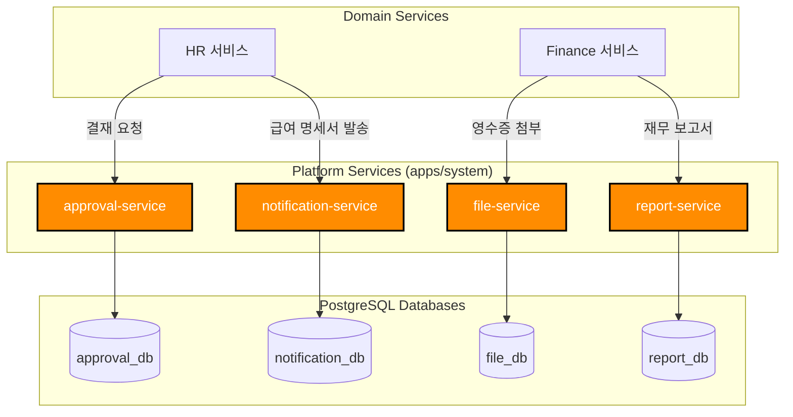

# TASK-P2-05: Platform 도메인 DB 연결 - 결과 보고서

## 📋 작업 요약

**작업 기간**: 2025-12-05  
**담당자**: AI Assistant  
**상태**: ✅ 완료

## 🎯 작업 목표

Platform 도메인(approval, report, notification, file 서비스)의 DB 연결을 신규 독립 DB로 전환하여 Database per Service 패턴을 완성하고, 시스템 전반을 지원하는 공통 기능을 강화합니다.

## ✅ 완료된 작업

### 1. Prisma 7 설정 파일 생성

각 서비스별로 독립적인 `prisma.config.ts` 파일을 생성하여 Prisma 7 호환성을 확보했습니다.

| 서비스 | 환경변수 | DB 이름 |
| --- | --- | --- |
| **approval-service** | `APPROVAL_DATABASE_URL` | `approval_db` |
| **report-service** | `REPORT_DATABASE_URL` | `report_db` |
| **notification-service** | `NOTIFICATION_DATABASE_URL` | `notification_db` |
| **file-service** | `FILE_DATABASE_URL` | `file_db` |

### 2. Prisma 스키마 수정 및 마이그레이션

각 서비스의 `schema.prisma`에서 `url` 속성을 제거하고, 마이그레이션을 통해 독립 DB 스키마를 생성했습니다.

```bash
# approval-service
pnpm prisma migrate dev --name init --config=/data/all-erp/apps/system/approval-service/prisma.config.ts

# report-service
pnpm prisma migrate dev --name init --config=/data/all-erp/apps/system/report-service/prisma.config.ts

# notification-service
pnpm prisma migrate dev --name init --config=/data/all-erp/apps/system/notification-service/prisma.config.ts

# file-service
pnpm prisma migrate dev --name init --config=/data/all-erp/apps/system/file-service/prisma.config.ts
```

**주요 테이블 구조**:
*   `approval_requests`: 결재 요청 정보 (유형, 기안자, 상태)
*   `reports`: CQRS Read Model을 위한 미리 계산된 보고서 데이터 (JSON)
*   `notifications`: 사용자별 알림 내역 및 읽음 상태
*   `files`: 업로드된 파일 메타데이터 및 스토리지 URL

### 3. 한글화된 마이그레이션 SQL

생성된 모든 SQL 파일에 테이블 및 컬럼의 용도를 설명하는 한국어 주석을 추가하여 유지보수성을 높였습니다.

## 📊 아키텍처 다이어그램

Platform 도메인은 다른 도메인 서비스들에게 공통 기능(Cross-Cutting Concerns)을 제공합니다.



## 🎓 Why This Matters (초급자를 위한 설명)

### 1. Platform 도메인의 역할
Platform 도메인은 비즈니스 로직(HR, Finance 등)을 직접 처리하지 않지만, 시스템이 돌아가는데 필수적인 **'기반 기능'**을 제공합니다. 이를 통해 각 도메인 서비스는 자신의 핵심 로직에만 집중할 수 있습니다.

*   **approval-service**: 휴가(HR), 지출(Finance), 구매(General) 등 모든 종류의 결재를 통합 처리합니다.
*   **notification-service**: 이메일, SMS, 앱 푸시 등 다양한 채널의 알림 발송을 중앙에서 관리합니다.
*   **file-service**: 파일 업로드/다운로드 및 스토리지(S3 등) 연동을 추상화하여 제공합니다.

### 2. CQRS와 Report Service
`report-service`는 **CQRS (Command Query Responsibility Segregation)** 패턴의 Query(조회) 쪽을 담당하는 핵심 컴포넌트입니다.

*   **문제점**: 월급날 전 직원이 동시에 급여 명세서를 조회하거나, 경영진이 복잡한 재무 보고서를 요청하면 DB 부하가 심해집니다.
*   **해결책**:
    1.  각 서비스(HR, Finance)에서 데이터 변경 시 이벤트 발행
    2.  `report-service`가 이벤트를 수신하여 보고서용 데이터 미리 계산 (Pre-calculation)
    3.  결과를 `reports` 테이블에 JSON으로 저장 (Denormalization)
    4.  사용자는 복잡한 조인 없이 `reports` 테이블에서 바로 조회 (고성능)

## 📈 데이터베이스 검증 결과

```bash
# approval_db
postgres=# \c approval_db
             List of relations
 Schema |       Name        | Type  |  Owner   
--------+-------------------+-------+----------
 public | approval_lines    | table | postgres
 public | approval_requests | table | postgres
 ...

# notification_db
postgres=# \c notification_db
             List of relations
 Schema |     Name      | Type  |  Owner   
--------+---------------+-------+----------
 public | notifications | table | postgres
 ...
```

## 💡 베스트 프랙티스

### 1. 파일 업로드 워크플로우 (Presigned URL)

`file-service`는 파일을 직접 받지 않고, 클라이언트가 스토리지에 직접 업로드할 수 있는 보안 URL을 발급합니다.

```typescript
// FileService
async function getUploadUrl(fileName: string, mimeType: string) {
  // 1. 보안 검증 (확장자, 용량 제한 등)
  this.validateFile(fileName, mimeType);
  
  // 2. 저장 경로 생성 (UUID 사용)
  const key = `uploads/${uuid()}/${fileName}`;
  
  // 3. AWS S3 Presigned URL 생성 (5분 유효)
  const url = await this.s3.getSignedUrlPromise('putObject', {
    Bucket: this.bucket,
    Key: key,
    ContentType: mimeType,
    Expires: 300
  });
  
  // 4. DB에 메타데이터 임시 저장 (PENDING 상태)
  await this.prisma.file.create({
    data: {
      fileName,
      mimeType,
      storageUrl: key,
      status: 'PENDING'
    }
  });
  
  return { uploadUrl: url, key };
}
```

### 2. 통합 알림 발송

채널(Email, SMS)에 상관없이 통일된 인터페이스로 알림을 요청합니다.

```typescript
// NotificationService
async function sendNotification(userId: string, type: 'EMAIL' | 'SMS', templateId: string, data: any) {
  // 1. 사용자 정보 및 수신 동의 여부 확인
  const userSettings = await this.getUserNotificationSettings(userId);
  if (!userSettings.marketingAgree && type === 'MARKETING') return;
  
  // 2. 템플릿 렌더링
  const { title, body } = await this.renderTemplate(templateId, data);
  
  // 3. 채널별 발송 (Strategy Pattern)
  await this.channels[type].send(userSettings.contact, title, body);
  
  // 4. 발송 이력 저장
  await this.prisma.notification.create({
    data: {
      userId,
      type,
      title,
      message: body,
      isRead: false
    }
  });
}
```

## 🎯 다음 단계

이제 모든 도메인(System, HR, Finance, General, Platform)의 DB 연결이 완료되었습니다!

1.  **Phase 2 완료 보고**: 전체 마이그레이션 현황 종합 및 이슈 정리
2.  **Phase 3 준비**: Docker Compose 통합 환경 구성 및 서비스 간 통신 테스트

## 📚 참고 문서

- [Microsoft Azure: CQRS Pattern](https://learn.microsoft.com/en-us/azure/architecture/patterns/cqrs)
- [AWS S3: Presigned URLs](https://docs.aws.amazon.com/AmazonS3/latest/userguide/PresignedUrlUploadObject.html)
- [Microservices Pattern: Shared Database vs Database per Service](https://microservices.io/patterns/data/database-per-service.html)
