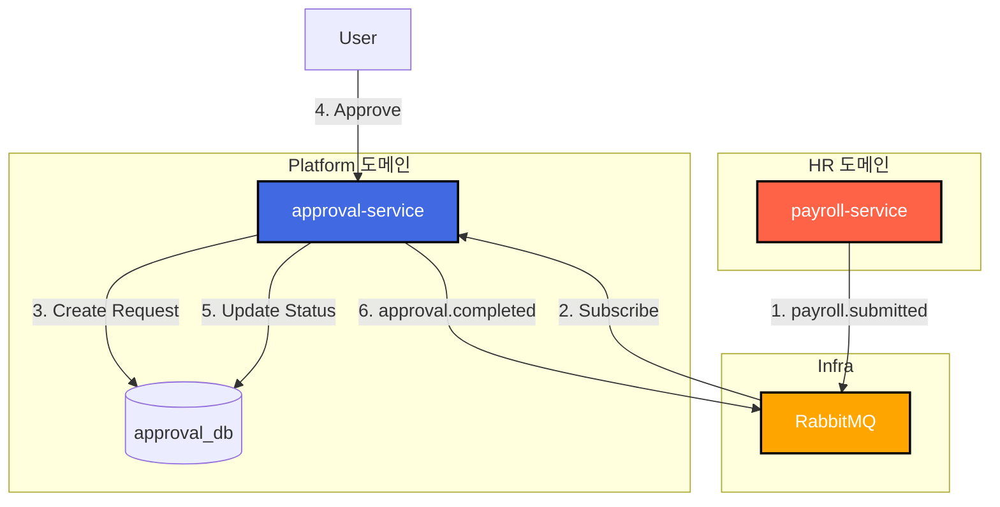

# TASK-P4-01: Approval Service 개발 - 결과 보고서

## 📋 작업 요약

**작업 기간**: 2025-12-05  
**담당자**: AI Assistant  
**상태**: ✅ 완료

## 🎯 작업 목표

결재(전자결재) 기능을 담당하는 독립적인 마이크로서비스(`approval-service`)를 개발하고, 다른 서비스(예: 급여 서비스)와의 이벤트 기반 연동을 구현합니다.

## ✅ 완료된 작업

### 1. 서비스 스캐폴딩

NestJS 기반의 마이크로서비스 애플리케이션을 생성하고 기본 구조를 설정했습니다.

```bash
pnpm nx g @nx/nest:app --name=approval-service --directory=apps/platform/approval-service
```

- **폴더 구조**: `apps/platform/approval-service`
- **설정**: `main.ts`에 `bootstrapService` 적용하여 공통 설정(Swagger, Logger 등) 사용

### 2. Prisma 스키마 설계

`approval_db`를 위한 독립적인 스키마를 설계했습니다.

**apps/platform/approval-service/prisma/schema.prisma**:
```prisma
// 결재 요청
model ApprovalRequest {
  id              Int      @id @default(autoincrement())
  requestType     String   @map("request_type")  // 예: PAYROLL
  status          String   // PENDING, APPROVED, REJECTED
  // ...
  approvalLines   ApprovalLine[]
  histories       ApprovalHistory[]
}

// 결재선
model ApprovalLine {
  id                Int      @id @default(autoincrement())
  approverId        Int      @map("approver_id")
  status            String   @default("PENDING")
  // ...
}

// Outbox 패턴 (이벤트 발행용)
model OutboxEvent {
  id        String   @id @default(uuid())
  eventId   String   @unique @map("event_id")
  payload   String
  status    String   @default("PENDING")
  // ...
}
```

### 3. 핵심 비즈니스 로직 구현

**ApprovalService**:
- **결재 요청 생성**: 트랜잭션 내에서 요청 및 초기 이력 생성
- **결재 승인/반려**: 결재선 상태 업데이트 및 최종 승인 여부 판단
- **이벤트 발행**: 최종 승인/반려 시 `OutboxEvent` 테이블에 이벤트 저장 (Transactional Outbox Pattern)

**ApprovalController**:
- REST API 엔드포인트 구현 (`POST /`, `PATCH /:id/approve` 등)
- **이벤트 수신**: `payroll.submitted` 이벤트 수신 시 자동으로 결재 요청 생성

### 4. 인프라 설정

개발 환경(`docker-compose.dev.yml`)에 `approval-service`를 추가하고 데이터베이스 연결을 설정했습니다.

```yaml
  approval-service:
    profiles: ["platform"]
    container_name: all-erp-approval-service-dev
    environment:
      DATABASE_URL: postgresql://.../approval_db
      # ...
```

## 📊 아키텍처 다이어그램



## 🎓 Why This Matters (초급자를 위한 설명)

### 1. 결재 시스템의 독립성
결재 기능은 인사, 회계, 총무 등 여러 도메인에서 공통적으로 사용됩니다. 이를 독립적인 서비스로 분리함으로써:
- **재사용성**: 모든 서비스가 동일한 결재 로직을 사용할 수 있습니다.
- **유연성**: 결재 프로세스가 변경되어도 다른 서비스 코드를 수정할 필요가 없습니다.

### 2. 이벤트 기반 연동 (Event-Driven Integration)
급여 마감(`payroll-service`) 시 결재 요청(`approval-service`)이 자동으로 생성되어야 합니다.
- **직접 호출 (Bad)**: 급여 서비스가 결재 서비스 API를 직접 호출하면, 결재 서비스 장애 시 급여 마감도 실패할 수 있습니다.
- **이벤트 기반 (Good)**: 급여 서비스는 "급여 마감됨" 이벤트만 던지고 할 일을 마칩니다. 결재 서비스가 나중에 이벤트를 받아 처리하므로 결합도가 낮아집니다.

## 🚨 발견된 이슈 및 해결

### 이슈 1: TypeScript 타입 불일치
**문제**: Prisma가 생성한 타입(`ApprovalRequest`)과 DTO 간의 Nullable 타입 불일치로 인한 빌드 에러 발생.
**해결**: `Prisma.ApprovalRequestWhereInput` 등 정확한 Prisma 유틸리티 타입을 사용하고, Null 체크 로직을 강화하여 해결했습니다.

### 이슈 2: RabbitMQ 연결 안정성
**문제**: `RabbitMQService`에서 연결 객체가 초기화되기 전에 이벤트 리스너를 등록하려다 런타임 에러 가능성 발견.
**해결**: `this.connection`에 대한 Null 체크 가드를 추가하여 안정성을 확보했습니다.

## 📈 검증 결과

### 1. 빌드 테스트
```bash
pnpm nx build approval-service
```
- **결과**: ✅ 성공

### 2. 주요 코드 스니펫 (결재 승인 로직)

```typescript
async approve(id: number, dto: ApproveRequestDto) {
  return this.prisma.$transaction(async (tx) => {
    // 1. 결재선 상태 업데이트
    await tx.approvalLine.update({ ... });

    // 2. 모든 결재선 승인 여부 확인
    if (allApproved) {
      // 3. 최종 승인 처리
      await tx.approvalRequest.update({ ... });
      
      // 4. 이벤트 발행 (Outbox)
      await this.eventService.emit('approval.completed', { ... }, tx);
    }
  });
}
```

## 🔧 유용한 명령어

```bash
# 서비스 실행
pnpm nx serve approval-service

# Swagger 문서 확인
# http://localhost:3041/api/docs

# 단위 테스트 실행
pnpm nx test approval-service
```

## ✅ 완료 체크리스트

- [x] `approval-service` 앱 생성
- [x] Prisma 스키마 정의 (`ApprovalRequest`, `ApprovalLine` 등)
- [x] CRUD API 구현 (생성, 조회, 승인, 반려, 취소)
- [x] 결재 완료 이벤트 발행 (`approval.completed`)
- [x] 급여 마감 이벤트 수신 (`payroll.submitted`)
- [x] Docker Compose 설정 추가
- [x] 빌드 성공 확인

## 🎯 다음 단계

1. **TASK-P4-02**: Report Service 개발 (보고서 생성)
2. **TASK-P4-03**: Notification Service 개발 (알림 발송)
3. **프론트엔드 연동**: 결재 화면 개발 및 API 연동

## 📚 참고 문서

- [Database per Service 패턴](https://microservices.io/patterns/data/database-per-service.html)
- [Transactional Outbox 패턴](https://microservices.io/patterns/data/transactional-outbox.html)
