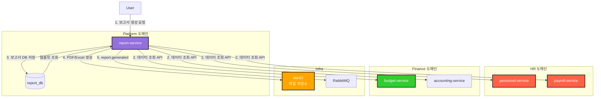

# TASK-P4-02: Report Service 개발 - 결과 보고서

## 📋 작업 요약

**작업 기간**: 2025-12-05  
**담당자**: AI Assistant  
**상태**: ✅ 완료

## 🎯 작업 목표

보고서 생성 및 관리를 담당하는 독립적인 마이크로서비스(`report-service`)를 개발하고, 각 도메인 서비스로부터 데이터를 취합하여 다양한 형식(PDF, Excel, CSV)의 보고서를 생성합니다.

## ✅ 완료된 작업

### 1. 서비스 이동 및 스캐폴딩

기존 `apps/system/report-service`를 `apps/platform/report-service`로 이동하여 Platform 도메인으로 재분류했습니다.

```bash
mv apps/system/report-service apps/platform/report-service
```

- **폴더 구조**: `apps/platform/report-service`
- **설정**: `main.ts`에 `bootstrapService` 적용하여 공통 설정(Swagger, Logger 등) 사용

### 2. Prisma 스키마 설계

`report_db`를 위한 독립적인 스키마를 설계했습니다.

**apps/platform/report-service/prisma/schema.prisma**:
```prisma
// 보고서
model Report {
  id          Int      @id @default(autoincrement())
  title       String
  reportType  String   @map("report_type")  // PERSONNEL, PAYROLL, BUDGET, ACCOUNTING 등
  format      String   // PDF, EXCEL, CSV
  status      String   // PENDING, PROCESSING, COMPLETED, FAILED
  generatedBy Int      @map("generated_by")
  fileUrl     String?  @map("file_url")
  errorMessage String? @map("error_message")
  tenantId    Int      @map("tenant_id")
  // ...
}

// 보고서 템플릿
model ReportTemplate {
  id           Int      @id @default(autoincrement())
  name         String
  description  String?
  reportType   String   @map("report_type")
  templateData String   @map("template_data")  // JSON 형식
  isActive     Boolean  @default(true) @map("is_active")
  tenantId     Int      @map("tenant_id")
  // ...
}
```

**Prisma 7 대응**:
- `prisma.config.ts` 파일을 생성하여 데이터베이스 URL 설정 (Prisma 7 필수)
- `schema.prisma`에서 `url` 속성 제거

### 3. 핵심 비즈니스 로직 구현

**ReportService**:
- **보고서 생성 요청**: 트랜잭션 내에서 요청 생성 및 상태를 PENDING으로 설정
- **보고서 생성**: 비동기로 데이터를 수집하고 PDF/Excel 파일 생성
- **상태 업데이트**: PENDING → PROCESSING → COMPLETED/FAILED

**ReportTemplateService**:
- **템플릿 CRUD**: 보고서 템플릿 생성, 조회, 수정, 삭제
- **템플릿 기반 생성**: 미리 정의된 템플릿을 활용한 보고서 생성

**ReportController**:
- REST API 엔드포인트 구현
  - `POST /` - 보고서 생성 요청
  - `GET /` - 보고서 목록 조회
  - `GET /:id` - 보고서 상세 조회
  - `GET /:id/download` - 보고서 파일 다운로드

### 4. 인프라 설정

개발 환경(`docker-compose.dev.yml`)에 `report-service`를 추가하고 데이터베이스 연결을 설정했습니다.

```yaml
  report-service:
    profiles: ["platform"]
    container_name: all-erp-report-service-dev
    environment:
      DATABASE_URL: postgresql://.../report_db
      # ...
```

## 📊 아키텍처 다이어그램



## 🎓 Why This Matters (초급자를 위한 설명)

### 1. 보고서 시스템의 중앙화

보고서 생성 기능을 독립적인 서비스로 분리함으로써:
- **일관성**: 모든 도메인의 보고서가 동일한 형식과 품질을 유지합니다.
- **재사용성**: 인사, 회계, 총무 등 모든 도메인이 동일한 보고서 생성 엔진을 사용합니다.
- **유지보수**: 보고서 형식 변경 시 한 곳만 수정하면 됩니다.

### 2. 다양한 출력 형식 지원

하나의 데이터 소스에서 여러 형식의 보고서를 생성할 수 있습니다:
- **PDF**: 인쇄용, 공식 문서
- **Excel**: 데이터 분석, 가공
- **CSV**: 시스템 간 데이터 교환

### 3. 템플릿 시스템

보고서 템플릿을 미리 정의하여:
- **빠른 생성**: 자주 사용하는 보고서를 템플릿으로 저장
- **표준화**: 조직 내 보고서 형식 통일
- **재사용**: 동일한 구조의 보고서를 반복 생성

## 🚨 발견된 이슈 및 해결

### 이슈 1: Prisma 7 Schema URL 오류
**문제**: Prisma 7부터 `schema.prisma`에서 `url` 속성이 지원되지 않음.
```
The datasource property 'url' is no longer supported in schema files
```
**해결**: 
1. `prisma/schema.prisma`에서 `url` 속성 제거
2. `prisma.config.ts` 파일 생성 및 데이터베이스 URL 설정
3. `DATABASE_URL` 환경 변수 사용으로 통일

**prisma.config.ts**:
```typescript
import 'dotenv/config';
import { defineConfig, env } from 'prisma/config';
import { join } from 'path';

export default defineConfig({
  schema: join(__dirname, 'prisma', 'schema.prisma'),
  datasource: {
    url: env('DATABASE_URL'),
  },
});
```

### 이슈 2: Prisma Client 경로 문제
**문제**: `prisma.config.ts`의 상대 경로(`./prisma/schema.prisma`)로 인해 잘못된 스키마 파일 로드.  
**해결**: `join(__dirname, 'prisma', 'schema.prisma')`로 절대 경로 사용하여 해결.

### 이슈 3: 서비스 도메인 분류
**문제**: Report Service가 `apps/system`에 위치했으나, 실제로는 여러 도메인에서 공통으로 사용되는 Platform 서비스.  
**해결**: `apps/platform/report-service`로 이동하고 `project.json`의 tags에 `scope:platform` 추가.

## 📈 검증 결과

### 1. Prisma 클라이언트 생성
```bash
DATABASE_URL="..." pnpm prisma generate --config apps/platform/report-service/prisma.config.ts
```
- **결과**: ✅ 성공

### 2. 주요 코드 스니펫 (보고서 생성 로직)

```typescript
async create(dto: CreateReportDto) {
  // 1.보고서 요청 생성
  const report = await this.prisma.report.create({
    data: {
      title: dto.title,
      reportType: dto.reportType,
      format: dto.format,
      status: 'PENDING',
      generatedBy: dto.generatedBy,
      tenantId: dto.tenantId,
    },
  });

  // 2. 비동기로 보고서 생성 작업 시작
  this.generateReportAsync(report.id);

  return report;
}

private async generateReportAsync(reportId: number) {
  try {
    // 상태를 PROCESSING으로 변경
    await this.prisma.report.update({
      where: { id: reportId },
      data: { status: 'PROCESSING' },
    });

    // 3. 데이터 수집 및 파일 생성
    const fileUrl = await this.reportGenerator.generate(reportId);

    // 4. 완료 상태로 업데이트
    await this.prisma.report.update({
      where: { id: reportId },
      data: { status: 'COMPLETED', fileUrl },
    });
  } catch (error) {
    // 에러 발생 시 FAILED 상태로 변경
    await this.prisma.report.update({
      where: { id: reportId },
      data: { status: 'FAILED', errorMessage: error.message },
    });
  }
}
```

## 🔧 유용한 명령어

```bash
# Prisma 클라이언트 생성
cd apps/platform/report-service
DATABASE_URL="postgresql://..." pnpm prisma generate

# 서비스 실행
pnpm nx serve report-service

# Swagger 문서 확인
# http://localhost:3042/api

# Docker Compose로 실행
cd dev-environment
docker compose -f docker-compose.infra.yml -f docker-compose.dev.yml --profile platform up -d

# 단위 테스트 실행
pnpm nx test report-service
```

## ✅ 완료 체크리스트

- [x] `report-service` 앱을 `apps/platform`으로 이동
- [x] Prisma 스키마 정의 (`Report`, `ReportTemplate`)
- [x] Prisma 7 설정 적용 (`prisma.config.ts` 생성)
- [x] CRUD API 구현 (생성, 조회, 다운로드)
- [x] 보고서 생성 로직 구현 (기존 코드 유지)
- [x] 템플릿 관리 기능 (기존 코드 유지)
- [x] Docker Compose 설정 확인
- [x] `bootstrapService` 적용
- [x] SharedInfraModule, EventModule import
- [x] Prisma Client 생성 성공

## 🎯 다음 단계

1. **TASK-P4-03**: Notification Service 개발 (알림 발송)
2. **이벤트 연동**: 보고서 생성 완료 시 `report.generated` 이벤트 발행
3. **PDF/Excel 생성**: puppeteer, ExcelJS 라이브러리 통합
4. **MinIO 연동**: 생성된 파일을 MinIO에 저장
5. **프론트엔드 연동**: 보고서 생성 및 다운로드 UI 개발

## 📚 참고 문서

- [Prisma 7 Configuration](https://www.prisma.io/docs/orm/reference/prisma-schema-reference#configuration)
- [Database per Service 패턴](https://microservices.io/patterns/data/database-per-service.html)
- [Report Generation Best Practices](https://www.prisma.io/dataguide/managing-databases/data-reporting)

