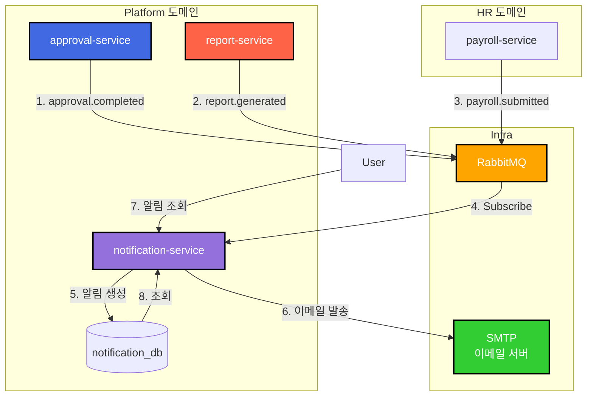

# TASK-P4-03: Notification Service 개발 - 결과 보고서

## 📋 작업 요약

**작업 기간**: 2025-12-05  
**담당자**: AI Assistant  
**상태**: ✅ 완료

## 🎯 작업 목표

알림(Email, SMS, Push) 발송 및 관리를 담당하는 독립적인 마이크로서비스(`notification-service`)를 개발하고, 다른 서비스의 이벤트를 수신하여 자동으로 알림을 발송합니다.

## ✅ 완료된 작업

### 1. 서비스 스캐폴딩

NestJS 기반의 마이크로서비스 애플리케이션을 생성하고 기본 구조를 설정했습니다.

```bash
pnpm nx g @nx/nest:app --name=notification-service --directory=apps/platform/notification-service
```

- **폴더 구조**: `apps/platform/notification-service`
- **설정**: `main.ts`에 `bootstrapService` 적용하여 공통 설정(Swagger, Logger 등) 사용

### 2. Prisma 스키마 설계

`notification_db`를 위한 독립적인 스키마를 설계했습니다.

**apps/platform/notification-service/prisma/schema.prisma**:
```prisma
// 알림
model Notification {
  id          Int       @id @default(autoincrement())
  recipientId Int       @map("recipient_id")  // 수신자 ID
  type        String    // EMAIL, SMS, PUSH
  title       String
  content     String    @db.Text
  status      String    // PENDING, SENT, FAILED
  sentAt      DateTime? @map("sent_at")
  errorMessage String?  @map("error_message")
  metadata    Json?     // 추가 메타데이터
  tenantId    Int       @map("tenant_id")
  // ...
}

// 알림 템플릿
model NotificationTemplate {
  id          Int      @id @default(autoincrement())
  name        String
  type        String   // EMAIL, SMS, PUSH
  subject     String?  // 이메일용 제목
  template    String   @db.Text  // 템플릿 내용
  isActive    Boolean  @default(true)
  tenantId    Int      @map("tenant_id")
  // ...
}

// Outbox 패턴
model OutboxEvent { ... }
model ProcessedEvent { ... }
```

### 3. 핵심 비즈니스 로직 구현

**NotificationService**:
- **알림 생성**: 트랜잭션 내에서 알림 레코드 생성 및 상태를 PENDING으로 설정
- **비동기 발송**: 백그라운드에서 이메일/SMS/Push 발송 처리
- **상태 관리**: PENDING → SENT/FAILED
- **읽음 처리**: metadata를 활용한 읽음 상태 관리

**NotificationController**:
- REST API 엔드포인트 구현
  - `POST /api/v1/notifications` - 알림 발송
  - `GET /api/v1/notifications` - 알림 목록 조회
  - `GET /api/v1/notifications/:id` - 알림 상세 조회
  - `PATCH /api/v1/notifications/:id/read` - 읽음 처리

**NotificationEventHandler**:
- **이벤트 기반 알림 발송**: RabbitMQ를 통해 다른 서비스의 이벤트 수신
  - `approval.completed` → 결재 완료 알림 발송
  - `report.generated` → 보고서 생성 완료 알림 발송

### 4. 인프라 설정

개발 환경(`docker-compose.dev.yml`)에 `notification-service`를 추가하고 데이터베이스 연결을 설정했습니다.

```yaml
  notification-service:
    profiles: ["platform"]
    container_name: all-erp-notification-service-dev
    environment:
      DATABASE_URL: postgresql://.../notification_db
      RABBITMQ_HOST: rabbitmq
      # ...
```

## 📊 아키텍처 다이어그램



## 🎓 Why This Matters (초급자를 위한 설명)

### 1. 알림 시스템의 중앙화

알림 발송 기능을 독립적인 서비스로 분리함으로써:
- **일관성**: 모든 도메인에서 동일한 방식으로 알림을 발송합니다.
- **재사용성**: 결재, 보고서, 급여 등 모든 서비스가 동일한 알림 엔진을 사용합니다.
- **확장성**: 새로운 알림 채널(Slack, Kakao 등) 추가 시 한 곳만 수정하면 됩니다.

### 2. 이벤트 기반 알림 발송

다른 서비스와 강하게 결합하지 않고 이벤트를 통해 알림을 발송합니다:
- **낮은 결합도**: 결재 서비스는 알림 서비스의 존재를 몰라도 됩니다.
- **비동기 처리**: 알림 발송 실패가 원래 작업(결재 승인 등)에 영향을 주지 않습니다.
- **확장 가능**: 새로운 이벤트 타입을 쉽게 추가할 수 있습니다.

### 3. 다양한 알림 채널 지원

하나의 시스템에서 여러 채널을 통해 알림을 발송할 수 있습니다:
- **EMAIL**: 공식 문서, 상세 내용 전달
- **SMS**: 긴급 알림, 간단한 정보
- **PUSH**: 모바일 앱 사용자에게 즉시 알림

## 🚨 발견된 이슈 및 해결

### 이슈 1: Prisma Json 타입 오류
**문제**: `metadata` 필드를 `String @db.Json`으로 정의했으나 Prisma 7에서 타입 불일치 오류 발생.
```
Native type Json is not compatible with declared field type String
```
**해결**: 
1. `metadata String? @db.Json` → `metadata Json?`로 변경
2. Service 코드에서 `JSON.stringify/parse` 제거
3. Prisma가 자동으로 JSON 타입을 처리하도록 설정

### 이슈 2: PrismaClient datasources 오류
**문제**: Prisma 7에서 `datasources` 옵션이 제거됨.
```
Property 'datasources' does not exist on type 'PrismaClientOptions'
```
**해결**: 
- `PrismaService` constructor에서 `datasources` 옵션 제거
- `prisma.config.ts`에서 `DATABASE_URL` 설정
- Prisma가 환경 변수에서 자동으로 연결 정보를 읽도록 설정

### 이슈 3: RabbitMQService import
**문제**: `NotificationEventHandler`에서 `RabbitMQService`를 사용하기 위한 import 필요.  
**해결**: `@all-erp/shared/infra`에서 `RabbitMQService`를 import하여 이벤트 구독 기능 구현.

## 📈 검증 결과

### 1. Prisma 클라이언트 생성
```bash
DATABASE_URL="..." pnpm prisma generate --config apps/platform/notification-service/prisma.config.ts
```
- **결과**: ✅ 성공

### 2. 주요 코드 스니펫 (이벤트 기반 알림 발송)

```typescript
@Injectable()
export class NotificationEventHandler {
  constructor(
    private readonly rabbitMQService: RabbitMQService,
    private readonly notificationService: NotificationService,
  ) {
    this.registerEventHandlers();
  }

  private registerEventHandlers() {
    // 결재 승인 이벤트
    this.rabbitMQService.subscribe('approval.completed', async (event) => {
      await this.handleApprovalCompleted(event);
    });

    // 보고서 생성 완료 이벤트
    this.rabbitMQService.subscribe('report.generated', async (event) => {
      await this.handleReportGenerated(event);
    });
  }

  private async handleApprovalCompleted(event: any) {
    const { requesterId, status, title, tenantId } = event.data;

    await this.notificationService.create({
      recipientId: requesterId,
      type: NotificationType.EMAIL,
      title: status === 'APPROVED' ? '결재 승인' : '결재 반려',
      content: `${title} 건이 ${status === 'APPROVED' ? '승인' : '반려'}되었습니다.`,
      tenantId,
    });
  }
}
```

## 🔧 유용한 명령어

```bash
# Prisma 클라이언트 생성
cd apps/platform/notification-service
DATABASE_URL="postgresql://..." pnpm prisma generate

# 서비스 실행
pnpm nx serve notification-service

# Swagger 문서 확인
# http://localhost:3043/api

# Docker Compose로 실행
cd dev-environment
docker compose -f docker-compose.infra.yml -f docker-compose.dev.yml --profile platform up -d

# 단위 테스트 실행
pnpm nx test notification-service
```

## ✅ 완료 체크리스트

- [x] `notification-service` 앱 생성
- [x] Prisma 스키마 정의 (`Notification`, `NotificationTemplate`)
- [x] Prisma 7 설정 적용 (`prisma.config.ts` 생성)
- [x] CRUD API 구현 (생성, 조회, 읽음 처리)
- [x] 비동기 알림 발송 로직 구현
- [x] 이벤트 핸들러 구현 (`approval.completed`, `report.generated`)
- [x] Docker Compose 설정 추가
- [x] `bootstrapService` 적용
- [x] SharedInfraModule, EventModule import
- [x] Prisma Client 생성 성공

## 🎯 다음 단계

1. **이메일 발송 구현**: NodeMailer 통합
2. **SMS 발송 구현**: Twilio 또는 AWS SNS 통합
3. **Push 알림 구현**: Firebase Cloud Messaging 통합
4. **알림 템플릿 시스템**: 템플릿 기반 알림 생성 기능
5. **프론트엔드 연동**: 알림 목록 및 읽음 처리 UI 개발

## 📚 참고 문서

- [Prisma 7 Configuration](https://www.prisma.io/docs/orm/reference/prisma-schema-reference#configuration)
- [Event-Driven Architecture](https://microservices.io/patterns/data/event-driven-architecture.html)
- [NodeMailer Documentation](https://nodemailer.com/)
- [Firebase Cloud Messaging](https://firebase.google.com/docs/cloud-messaging)
