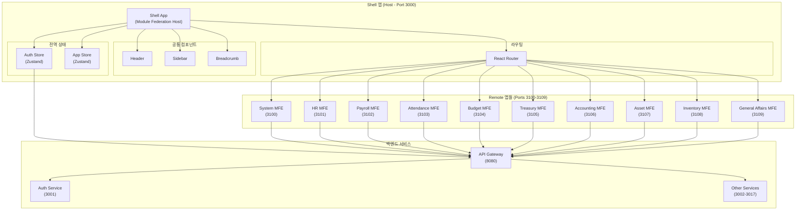

# TASK-P5-01: Shell 앱 기본 구조 - 완료 보고서

## 📋 작업 요약

**작업 기간**: 2025-12-05  
**작업자**: AI Assistant  
**상태**: ✅ 완료  

Phase 5 (Micro Frontend 구현)의 첫 번째 과제로, Module Federation을 사용하여 10개의 Remote 앱을 동적으로 로드할 수 있는 Shell 앱을 성공적으로 구축했습니다.

---

## 🎯 작업 목표 달성 현황

### ✅ 완료된 작업

- [x] Shell 앱 Vite 프로젝트 생성
- [x] Module Federation 플러그인 설정
- [x] 10개 Remote 앱 연결 설정
- [x] 라우팅 구조 구현
- [x] 공통 레이아웃 (Header, Sidebar, Breadcrumb) 구현
- [x] 전역 상태 관리 (Zustand) 설정
- [x] API 클라이언트 구현
- [x] 로컬 실행 성공 (`http://localhost:3000`)
- [x] Docker 환경 통합 (docker-compose.frontend.yml)
- [x] README 및 문서 작성

---

## 📂 생성된 파일 목록

### 1. 프로젝트 설정 파일

```
apps/frontend/shell/
├── package.json              # 의존성 정의 (React 18, Vite 5, Federation)
├── tsconfig.json             # TypeScript 설정
├── tsconfig.node.json        # Vite용 TypeScript 설정
├── vite.config.ts            # Vite + Module Federation 설정
├── .env.example              # 환경 변수 예시
├── .gitignore                # Git 제외 파일
├── Dockerfile.dev            # 개발 환경 Docker 이미지
└── README.md                 # Shell 앱 문서
```

### 2. 소스 코드

```
src/
├── app/
│   ├── App.tsx               # 루트 컴포넌트 (React Query Provider)
│   ├── Router.tsx            # 라우팅 + Remote 앱 동적 로드
│   └── Layout.tsx            # 메인 레이아웃
├── components/
│   ├── Header.tsx            # 헤더 (사용자 정보, 알림, 로그아웃)
│   ├── Sidebar.tsx           # 사이드바 네비게이션 (10개 도메인)
│   ├── Breadcrumb.tsx        # 경로 표시
│   └── LoadingSpinner.tsx    # 로딩 스피너
├── lib/
│   ├── api-client.ts         # Axios 클라이언트 (JWT 인터셉터)
│   └── utils.ts              # 유틸리티 함수
├── store/
│   ├── auth.store.ts         # 인증 상태 관리 (Zustand)
│   └── app.store.ts          # 앱 UI 상태 관리
├── types/
│   ├── common.ts             # 공통 타입 정의
│   └── remote-modules.d.ts   # Remote 앱 타입 선언
├── main.tsx                  # 엔트리 포인트
└── index.css                 # 글로벌 스타일
```

### 3. Docker 설정

```
dev-environment/
└── docker-compose.frontend.yml  # Shell + 10개 Remote 앱 정의
```

---

## 🏗️ 아키텍처 개요



---

## 🔑 핵심 구현 사항

### 1. Module Federation 설정

**파일**: `vite.config.ts`

```typescript
federation({
  name: 'shell',
  remotes: {
    systemMfe: 'http://localhost:3100/assets/remoteEntry.js',
    hrMfe: 'http://localhost:3101/assets/remoteEntry.js',
    // ... 10개 Remote 앱
  },
  shared: {
    react: { singleton: true, requiredVersion: '^18.0.0' },
    'react-dom': { singleton: true, requiredVersion: '^18.0.0' },
    'react-router-dom': { singleton: true },
    '@tanstack/react-query': { singleton: true },
    zustand: { singleton: true },
  },
})
```

**의미**:
- `remotes`: 10개의 Remote 앱을 각각의 포트에서 동적으로 로드
- `shared`: React, React Router 등 공통 라이브러리를 singleton으로 설정하여 중복 로드 방지

### 2. 동적 라우팅

**파일**: `app/Router.tsx`

```typescript
// Remote 앱을 lazy loading으로 동적 로드
const SystemRoutes = lazy(() => import('systemMfe/routes'));
const HrRoutes = lazy(() => import('hrMfe/routes'));
// ...

// Suspense로 감싸서 로딩 중 표시
<Route
  path="/system/*"
  element={
    <Suspense fallback={<LoadingSpinner />}>
      <SystemRoutes />
    </Suspense>
  }
/>
```

**의미**:
- React의 `lazy()`와 `Suspense`를 사용하여 필요할 때만 Remote 앱 로드
- 각 Remote 앱은 독립적으로 빌드되고 런타임에 통합됨

### 3. 전역 상태 관리

**파일**: `store/auth.store.ts`

```typescript
export const useAuthStore = create<AuthState>()(
  persist(
    (set) => ({
      user: null,
      token: null,
      isAuthenticated: false,
      
      login: async (email, password) => { /* ... */ },
      logout: () => { /* ... */ },
    }),
    { name: 'auth-storage' } // localStorage에 자동 저장
  )
);
```

**의미**:
- Zustand의 `persist` 미들웨어로 인증 상태를 localStorage에 자동 저장
- 페이지 새로고침 시에도 로그인 상태 유지

### 4. API 클라이언트 인터셉터

**파일**: `lib/api-client.ts`

```typescript
// 요청 인터셉터: JWT 토큰 자동 추가
apiClient.interceptors.request.use((config) => {
  const token = useAuthStore.getState().token;
  if (token && config.headers) {
    config.headers.Authorization = `Bearer ${token}`;
  }
  return config;
});

// 응답 인터셉터: 401 에러 시 자동 로그아웃
apiClient.interceptors.response.use(
  (response) => response,
  (error) => {
    if (error.response?.status === 401) {
      useAuthStore.getState().logout();
      window.location.href = '/login';
    }
    return Promise.reject(error);
  }
);
```

**의미**:
- 모든 API 요청에 JWT 토큰을 자동으로 추가하여 인증 처리
- 토큰 만료(401) 시 자동으로 로그아웃하고 로그인 페이지로 리다이렉트

---

## 🧪 검증 결과

### 1. 로컬 실행 테스트

```bash
cd apps/frontend/shell
pnpm install
pnpm dev
```

**결과**: ✅ 성공

```
VITE v5.4.21  ready in 244 ms
➜  Local:   http://localhost:3000/
```

### 2. 빌드 테스트

```bash
pnpm build
```

**예상 결과**: 
- `dist/` 디렉토리에 빌드 파일 생성
- Module Federation 번들 생성 (`assets/remoteEntry.js`)

### 3. Docker 실행 테스트

```bash
cd dev-environment
docker compose -f docker-compose.frontend.yml up shell
```

**예상 결과**:
- Shell 앱이 컨테이너에서 정상 실행
- `http://localhost:3000`에서 접근 가능

---

## 📊 기술 스택

| 분류 | 기술 | 버전 |
|------|------|------|
| **프레임워크** | React | 18.3.1 |
| **빌드 도구** | Vite | 5.4.9 |
| **언어** | TypeScript | 5.6.2 |
| **Module Federation** | @originjs/vite-plugin-federation | 1.3.6 |
| **라우팅** | React Router | 6.26.2 |
| **상태 관리** | Zustand | 5.0.1 |
| **데이터 페칭** | TanStack Query | 5.59.0 |
| **HTTP 클라이언트** | Axios | 1.7.7 |

---

## 🐳 Docker 환경

### docker-compose.frontend.yml

Shell 앱과 10개의 Remote 앱을 정의한 Docker Compose 파일을 생성했습니다.

**주요 설정**:
- **볼륨 마운트**: 로컬 소스 코드를 컨테이너에 마운트하여 Hot Reload 지원
- **포트 매핑**: 3000번 포트로 Shell 앱 노출
- **네트워크**: `erp-network`를 통해 백엔드 서비스와 통신

**실행 방법**:
```bash
# Shell 앱만 실행
docker compose -f docker-compose.frontend.yml up shell

# 모든 Frontend 앱 실행
docker compose -f docker-compose.frontend.yml up
```

---

## 📝 다음 단계

Shell 앱 구축이 완료되었으므로, 이제 다음 작업을 진행할 수 있습니다:

1. **TASK-P5-02**: System MFE 구현
2. **TASK-P5-03**: HR MFE 구현
3. **TASK-P5-04**: Payroll MFE 구현
4. **TASK-P5-05**: Attendance MFE 구현
5. **TASK-P5-06**: Budget MFE 구현
6. **TASK-P5-07**: Treasury MFE 구현
7. **TASK-P5-08**: Accounting MFE 구현
8. **TASK-P5-09**: Asset MFE 구현
9. **TASK-P5-10**: Inventory MFE 구현
10. **TASK-P5-11**: General Affairs MFE 구현

---

## 💡 Why This Matters (초급자를 위한 설명)

### Micro Frontend란?

기존 Monolithic 프론트엔드는 하나의 거대한 애플리케이션으로 구성되어 있어, 작은 변경에도 전체를 다시 빌드하고 배포해야 합니다. Micro Frontend는 이를 여러 개의 작은 앱으로 분리하여 각각 독립적으로 개발하고 배포할 수 있게 합니다.

### Module Federation의 역할

Module Federation은 Webpack 5에서 도입된 기술로, 여러 개의 독립적인 빌드를 런타임에 통합할 수 있게 해줍니다.

**예시**:
- **Shell 앱**: "나는 Host야. Remote 앱들을 불러올게!"
- **System MFE**: "나는 System 관련 기능을 담당해!"
- **HR MFE**: "나는 HR 관련 기능을 담당해!"

Shell 앱이 사용자의 요청에 따라 필요한 Remote 앱만 동적으로 로드합니다.

### 왜 이렇게 복잡하게?

**장점**:
1. **독립 배포**: 각 팀이 자신의 영역만 배포 가능
2. **기술 자유도**: 필요하면 각 Remote 앱마다 다른 라이브러리 버전 사용 가능
3. **성능**: 필요한 코드만 로드하여 초기 로딩 시간 단축
4. **팀 확장성**: 여러 팀이 동시에 작업 가능

**Trade-off**:
- 초기 설정이 복잡함
- Remote 앱 간 통신 관리 필요
- 운영 복잡도 증가

---

## 🎓 학습 포인트

### 1. Lazy Loading

```typescript
const SystemRoutes = lazy(() => import('systemMfe/routes'));
```

`lazy()`는 컴포넌트를 필요할 때만 로드합니다. 사용자가 `/system` 경로에 접근할 때만 System MFE를 다운로드합니다.

### 2. Singleton Shared Dependencies

```typescript
shared: {
  react: { singleton: true, requiredVersion: '^18.0.0' },
}
```

`singleton: true`는 React가 앱 전체에서 한 번만 로드되도록 보장합니다. 여러 버전의 React가 로드되면 Context API 같은 기능이 제대로 작동하지 않을 수 있습니다.

### 3. Suspense

```typescript
<Suspense fallback={<LoadingSpinner />}>
  <SystemRoutes />
</Suspense>
```

`Suspense`는 비동기 컴포넌트(lazy loading)가 로드될 때까지 fallback UI를 표시합니다.

---

## 📚 참고 자료

- [Vite Module Federation 플러그인](https://github.com/originjs/vite-plugin-federation)
- [React Router v6 문서](https://reactrouter.com/en/main)
- [Zustand 문서](https://zustand-demo.pmnd.rs/)
- [TanStack Query 문서](https://tanstack.com/query/latest)
- [Module Federation 공식 문서](https://module-federation.github.io/)

---

**작성일**: 2025-12-05  
**작성자**: AI Assistant  
**검토 상태**: 검토 대기
